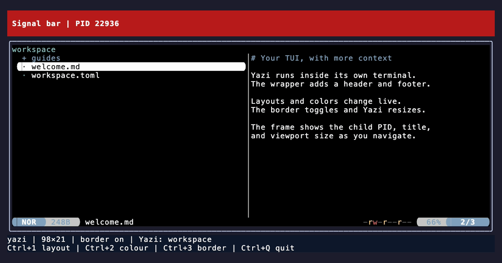

`go-tui-frame` lets Go applications put their own UI around an external TUI. Wrap an editor, shell, or interactive tool with styled headers, footers, side regions, and a border, then update them from your application's events. The child keeps its own terminal; input passes through by default.



# What It Does

- **Custom frame:** Draw into region-sized cell buffers. Use Lip Gloss for styles and layers, or draw directly without it.
- **Concise configuration:** Chain region declarations and optional handlers, then call `Run(ctx)`.
- **Live updates:** Push typed application data to individual regions and toggle the child border during a session.
- **Child information:** Read terminal cells, title, cursor, modes, process metadata, and PTY settings; observe input, output, and lifecycle events.
- **Optional shortcuts:** Capture selected keys and forward the rest. The library has no default bindings or pane management.
- **Standalone executable:** The terminal emulator links into your binary. Running it requires no Ghostty installation or multiplexer server.

# How It Works

1. Supply an unstarted `exec.Cmd`, initial application data, and drawing callbacks for the regions you want.
2. Call `Run(ctx)`. The child starts with the terminal space left inside the frame.
3. Use the child normally. Your callbacks receive its snapshot and your region's data. Application events can push updates while the child is idle.
4. When the child exits or the context is canceled, the session restores the terminal and returns the child result and any session error.

# How it Really Works

1. **The child has a separate terminal display.** Its erase, cursor, reset, and alternate-screen operations stay inside its viewport. That display is combined with your regions before writing to the outer terminal.
2. **Input follows the child's protocol.** Keyboard bytes stay unchanged when outer and child protocols agree; negotiated differences are converted. Mouse coordinates become child-local coordinates. Input over the frame is not mapped to an invented child position. Up to 1 MiB of converted input waits for a child that is not reading; beyond that, the frame stops reading the outer terminal until the child reads again, as a terminal connected directly to the child would wait. A terminal hangup still ends the session.
3. **Updates are event-driven.** Initial drawing, application invalidation, relevant child changes, and resize trigger rendering. Child-output bursts share a repaint deadline of about 17 ms. Normal rendering updates damaged rows and emits only changed cells, with synchronized output when the outer terminal reports support. Idle sessions have no periodic redraw or metadata polling timer. Input modes and protocol replies take effect without waiting for repaint.
4. **One session owns terminal I/O.** Construction has no terminal side effects; `Run` blocks. Draw into the supplied canvases and submit updates through the controller. Concurrent terminal writes interfere with the composed display.
5. **Metadata has limits.** Snapshots own their data, and OS fields report availability and errors. Terminal output reveals the child's display and protocol requests; it cannot reveal an arbitrary application's widget tree or editor buffers.

# Prerequisites

- Linux or macOS and an interactive terminal. Windows is unsupported.
- The child executable you want to wrap, such as `nvim`.
- [Go](https://go.dev/dl/) 1.27.1 or newer to build a consumer.
- CGO, a C compiler, `pkg-config`, and the pinned libghostty headers/static archive at build time. Building the archive requires Zig 0.16.0; follow the [native build setup](docs/internal/references/native-build.md).

The compiled consumer needs no separate libghostty runtime. macOS binaries use OS-provided system libraries; the repository's Linux builds link statically with musl. The child executable and outer terminal are still required.

# Installation

```sh
go get github.com/alexgorbatchev/go-tui-frame
```

Set up the native archive before compiling your consumer; `go get` installs the Go dependency, not the native build tools or archive.

# Quick Start

This complete program wraps Neovim in a three-row red header showing application status and child PID, with a footer showing the child's title and viewport size.

```go
package main

import (
	"context"
	"fmt"
	"os"
	"os/exec"

	"charm.land/lipgloss/v2"
	frame "github.com/alexgorbatchev/go-tui-frame"
	uv "github.com/charmbracelet/ultraviolet"
)

type UIData struct{ Status string }

func main() {
	banner := lipgloss.NewStyle().
		Background(lipgloss.Color("#B91C1C")).
		Foreground(lipgloss.Color("#FFFFFF")).Bold(true).Padding(0, 1)

	app := frame.New(exec.Command("nvim", "--clean"), UIData{Status: "Ready"}).
		Header(3, func(ctx frame.DrawContext[UIData]) {
			text := fmt.Sprintf("My workspace · PID %d\n%s", ctx.Term.Child.PID, ctx.Data.Status)
			paint(ctx.View, banner, text)
		}).
		Footer(1, func(ctx frame.DrawContext[UIData]) {
			text := fmt.Sprintf("%s · %d×%d",
				ctx.Term.Terminal.Title, ctx.Term.Viewport.Cols, ctx.Term.Viewport.Rows)
			paint(ctx.View, lipgloss.NewStyle().Foreground(lipgloss.Color("#9CA3AF")), text)
		}).
		Border(true)

	result, err := app.Run(context.Background())
	if err != nil {
		fmt.Fprintln(os.Stderr, err)
		os.Exit(1)
	}
	if !result.ProcessState.Success() {
		fmt.Fprintln(os.Stderr, result.ProcessState)
		os.Exit(1)
	}
}

func paint(view uv.Screen, style lipgloss.Style, text string) {
	bounds := view.Bounds()
	if bounds.Empty() {
		return
	}
	lipgloss.NewLayer(style.
		Width(bounds.Dx()).Height(bounds.Dy()).
		MaxWidth(bounds.Dx()).MaxHeight(bounds.Dy()).Render(text)).Draw(view, bounds)
}
```

Lip Gloss is recommended for styling and used by this example; it is optional for library consumers. See the [demo app](cmd/tui-frame) for three interactive layouts with layered badges, background changes, and a live border toggle. Its [drawing callbacks](cmd/tui-frame/demo.go) and [capture handler](cmd/tui-frame/session.go) use the same public API.

## Push application updates

Keep `app` available to your application's event handlers while `Run` is blocking. For example, an indexing-completion handler can submit:

```go
if err := app.InvalidateHeader(UIData{Status: "Index complete"}); err != nil {
	return fmt.Errorf("update workspace status: %w", err)
}
```

Invalidation replaces that region's complete data value and schedules drawing. It is safe from any goroutine before or during `Run`, including while the child emits no output. Pending updates coalesce to the latest value. Submission performs no terminal I/O and does not wait for painting; there are no watcher declarations or refresh channels to manage.

Each region keeps its own data: updating the header does not update the footer. Data is copied by value, so keep referenced maps, slices, and pointers immutable while the frame can use them. Invalidating an absent region returns `ErrRegionNotConfigured`; submission after shutdown begins returns `ErrSessionClosed`.

# API

| Method | Signature | Purpose |
| :--- | :--- | :--- |
| `New` | `New[T any](cmd *exec.Cmd, initial T) *Frame[T]` | Create a controller for one unstarted command. |
| `Header`, `Footer` | `(rows int, draw func(DrawContext[T])) *Frame[T]` | Reserve top or bottom rows. |
| `Left`, `Right` | `(cols int, draw func(DrawContext[T])) *Frame[T]` | Reserve side columns between the header and footer. |
| `Border` | `(enabled bool) *Frame[T]` | Configure the initial one-cell child border. |
| `SetBorder` | `(enabled bool) error` | Submit a live border change. |
| `InvalidateHeader`, `InvalidateFooter` | `(data T) error` | Replace a region's data and schedule drawing. |
| `InvalidateLeft`, `InvalidateRight` | `(data T) error` | Replace a side region's data and schedule drawing. |
| `Capture` | `(handler func(Input) Disposition) *Frame[T]` | Consume selected keyboard events or pass them to the child. |
| `Observe` | `(handler func(Event)) *Frame[T]` | Receive owned observations without consuming input. |
| `ObserveEvents` | `(kinds []EventKind, handler func(Event)) *Frame[T]` | Receive only the selected observation kinds. |
| `Terminal` | `(input, output *os.File) *Frame[T]` | Borrow terminal files; defaults to standard input and output. |
| `InheritTerminal` | `(enabled bool) *Frame[T]` | Inherit reported terminal preferences and original PTY settings; enabled by default. |
| `Run` | `(ctx context.Context) (Result, error)` | Execute one session and wait for drain and cleanup. |

## Drawing context

All drawing callbacks receive the same strongly typed context:

```go
type DrawContext[T any] struct {
	Term Snapshot
	View uv.Screen
	Data T
}
```

`Term` is an owned child snapshot. `Data` is the selected region's application payload. `View` is a cleared, region-sized `uv.Screen` backed by a native screen buffer. `View.Bounds().Dx()` and `.Dy()` give its width and height in terminal cells. Coordinates start at the region's own origin.

Regions redraw for title, directory, size, terminal-mode, alternate-screen, or
scroll metadata changes, and for application invalidation. Text changes, cursor
movement, cursor visibility, and synchronized-update holds update the child
display without invalidating region canvases. Use region invalidation when your
application needs to redraw a region from those display details.

The drawing contract requires synchronous drawing into `View`; filling the region and using Lip Gloss styles are optional. You can call `SetCell` directly or draw any `uv.Drawable`. Lip Gloss layers implement that interface: `lipgloss.NewLayer(text).Draw(ctx.View, ctx.View.Bounds())`. For positioned or overlapping layers, use `lipgloss.NewCompositor(layers...).Draw(ctx.View, ctx.View.Bounds())`. The library clips the completed region with wide-cell boundaries preserved. [Screen and drawable interfaces](https://github.com/charmbracelet/ultraviolet/blob/878653296cfd/uv.go), [Lip Gloss layers](https://github.com/charmbracelet/lipgloss/blob/v2.0.6/layer.go).

For plain text without Lip Gloss, use the existing Ultraviolet drawing primitive:

```go
app.Header(1, func(ctx frame.DrawContext[UIData]) {
	uv.NewStyledString(ctx.Data.Status).Draw(ctx.View, ctx.View.Bounds())
})
```

The canvas is borrowed until the callback returns. Keep its dimensions, draw synchronously, and do not retain it. Callbacks run in the session's drawing path and must return promptly. Use offscreen styling; direct printing or terminal queries bypass the session's I/O ownership. `DrawContext` is drawing data, separate from the cancellation `context.Context` passed to `Run`.

## Session and layout

Configure the frame before calling `Run`; region declarations and handlers freeze at startup. Region sizes must be positive, the child viewport must fit, and the command must be unstarted with no conflicting stdio or process settings. The session owns command start/wait. Use a standard `exec.Cmd` to set `Dir` or `Env`; its arguments are passed without shell interpretation. [Go command semantics](https://pkg.go.dev/os/exec#Cmd).

`Run` borrows the outer terminal files and restores the state it acquires. For each cursor attribute the terminal reported at startup, the outer terminal shows the child's style or color; while they match what the terminal reported, the session writes neither. When the child's style or color returns to the reported value, and on exit, the session resets an attribute that differed to the terminal's defaults with `CSI 0 SP q` or `OSC 112`, so the cursor follows the terminal's configuration and theme again. Terminals that follow the VT510 definition of `CSI 0 SP q` show a blinking block instead. A cursor style or color override that was active before `Run`, such as an `OSC 12` color from a shell theme script, is lost once the child's cursor differs in that attribute, because the terminal reports an override and a default the same way. With `.InheritTerminal(false)`, the child starts with the emulator's default cursor style, so any other reported style differs even when the child never changes its cursor, and an entry style override is lost the same way. Input and output must refer to the same interactive terminal, with one frame owner at a time. Each controller executes one session and cannot be reused.

At startup, the child inherits reported foreground/background colors, the 256-color palette, cursor color/style/blink, supported preference modes, keyboard protocol settings, and light/dark color scheme. Its PTY receives the outer terminal's original line discipline, including control characters, echo, and flow control. Default-colored cells keep the outer terminal's default rendition, preserving its background appearance. Queries have a 300 ms deadline; missing or invalid replies retain native defaults.

The outer terminal's color profile is whatever `colorprofile.Detect` decides from the output and environment, including `TERM`, `COLORTERM`, `NO_COLOR`, terminfo, and tmux. On a 256-color profile, cells using an inherited palette entry the child has not redefined keep the outer terminal's palette index, so its theme colors them instead of the nearest 256-color value; a 16-color profile does this for entries 0–15, and higher entries keep their RGB approximation. Snapshot cells carry these indexed colors as `ansi.BasicColor` or `ansi.IndexedColor`, with the RGB in `Terminal.Native.Colors.Palette`. True-color terminals receive resolved RGB colors, and colorless profiles, such as `NO_COLOR` or `TERM=dumb`, receive no color; snapshot cells keep resolved RGB on both. Known limitation: Ultraviolet compares colors only by RGB value (`charmbracelet/ultraviolet#205`), and an index's value is its xterm default rather than the theme color. On a 256-color profile, two colors with the same such value, such as SGR 30 and `38;2;0;0;0` or `38;5;16`, can keep the earlier color when they are adjacent or one replaces the other, including an OSC 4 redefinition of an entry to its xterm default value or an OSC 104 reset from it. On a 16-color profile, only entries 7 and 8 are affected: when an entry and a color of its xterm value (`#c0c0c0`, `#808080`) replace each other, including an OSC 4 redefinition to that value or an OSC 104 reset from it, the earlier color can remain.

Use `.InheritTerminal(false)` or the demo's `--no-terminal-inheritance` flag before `--` to use emulator and PTY defaults. Capability and restoration probes still run. Font, shaping, opacity, window settings, and terminal key mappings belong to the outer terminal and cannot be disabled inside a viewport. Screen contents, scrollback, margins, and application mouse tracking belong to the new child session; graphics and clipboard permissions remain subject to the documented endpoint capabilities. Preferences are captured at startup; live changes to the outer terminal's theme are not queried again.

Region reservations stay fixed. Outer resize recomputes their canvases and the child viewport. `SetBorder` is safe concurrently before and during `Run`; it coalesces pending requests and resizes the child's native terminal and PTY when applied, preserving measured cell pixels. It returns `ErrSessionClosed` after shutdown begins. Acceptance does not acknowledge painting; an inset that cannot fit ends the session with `ErrViewportTooSmall`.

`Result.ProcessState` contains the child exit outcome after a successful start and wait. A nonzero child exit is a result; configuration, startup, transport, observation, drain, and restoration failures are session errors. `DrainError` and `CleanupError` preserve their respective outcomes. Inspect the result as well as the returned error.

Cancellation sends SIGTERM and SIGCONT to observed groups in the owned child session, then SIGKILL after one second if needed. If the launch leader has not exited two seconds after SIGKILL, the session closes the child PTY, discarding output it has not read, and waits for the leader; the discarded output is not reported as an error. This bound matters on macOS, where an exiting session leader waits for its queued output to be read, and output that flow control stopped, as Ctrl+S does, cannot be read. Output drain has a two-second deadline after the launch leader exits. Descendants that create another session can escape cleanup; suspend/resume of the wrapper's terminal session is unsupported. Canceling the context during `Run`, before the child exits, makes it return the context's cause (`context.Cause`), joined with any errors from the shutdown that follows; a session error that ended the session first is returned without the cause. Such a cancellation therefore returns an error even when nothing failed; cancel with a cause of your own to recognize a requested stop, as [Keyboard Capture](#keyboard-capture) does.

# Keyboard Capture

Capture is opt-in. To add Ctrl+Q to the Quick Start, add `errors` to its imports and replace its `Run` call with the following, keeping the error and exit-status checks after it:

```go
ctx, cancel := context.WithCancelCause(context.Background())
defer cancel(nil)

result, err := app.Capture(func(input frame.Input) frame.Disposition {
	if !input.Key.Key().MatchString("ctrl+q") {
		return frame.Pass
	}
	if _, pressed := input.Key.(uv.KeyPressEvent); pressed {
		cancel(errQuit)
	}
	return frame.Consume
}).Run(ctx)
if quitOnly(err) {
	return
}
```

Then add the quit cause and its check at package level:

```go
var errQuit = errors.New("quit requested")

// quitOnly reports whether err holds errQuit and nothing else. Run joins the
// cancellation cause with any errors from the shutdown that follows.
func quitOnly(err error) bool {
	joined, ok := err.(interface{ Unwrap() []error })
	if !ok {
		return err == errQuit
	}
	errs := joined.Unwrap()
	for _, e := range errs {
		if !quitOnly(e) {
			return false
		}
	}
	return len(errs) > 0
}
```

When nothing else fails, a quit while the child runs makes `Run` return an error that holds only `errQuit`, the cancellation cause, and `Result.ProcessState` reports how the child ended once the frame terminated it rather than an outcome of its own. `main` therefore returns, with status 0, before the Quick Start's checks. Errors from the shutdown that follows, such as a terminal that could not be restored, are joined with the cause; `errors.Is(err, errQuit)` would match them too, while `quitOnly` leaves them to the error check, which reports them and exits 1.

Use `uv "github.com/charmbracelet/ultraviolet"`. `Input.Key` carries the recognized key event; `Input.Raw` is an owned copy of its original bytes. A Kitty report fills the key's `BaseCode` and `ShiftedCode` only with alternate keys: the child's own, or those capture adds for a child without Kitty disambiguation. `String()` returns the key's text when it has any and otherwise falls back to `Keystroke()`, which prefers `BaseCode`. Russian Ctrl+й therefore reads as `ctrl+q` with alternate keys and as `ctrl+й` while a child that disambiguates without them runs; `MatchString("ctrl+q")` matches it in neither case. For a binding with Ctrl or Super, such as `ctrl+q`, `MatchString` compares only the reported key code and modifiers, which alternate keys do not change, so the binding holds for every child. Lock state does not count as a modifier unless the binding names it: a Kitty report carries the bit of an enabled Caps Lock or Num Lock, and `ctrl+q` still matches it. Caps Lock counts only for a key whose text has a character that `unicode.ToUpper` and `unicode.ToLower` map to different runes, so not `ß`; such a key matches through its text, so Caps Lock with `a` matches `A` but not `a`. An Alt binding holds the same way only where Alt does not type a character: on macOS, an Option key that types a character arrives as that text unless the outer terminal reports every key as an escape code. `MatchString` also compares text, which alternate keys can change, so a Shift-only printable binding such as `!` can depend on the child's flags: when the outer terminal reports every key as an escape code, US Shift+1 decodes with the text `1` without alternate keys or associated text and with `!` when either is on. `Pass` forwards input through normal child routing; `Consume` withholds it. This handler acts on presses, including reported repeats, and consumes matching releases without another action. Capture runs inline and must return promptly.

When releases are reported, the press determines ownership of its repeats and final release. Recognized paste payloads bypass key capture; unmarked paste cannot be distinguished from typing. Observation does not consume input.

Explicit capture requests distinct key reports through verified Kitty disambiguation, or verified modifyOtherKeys mode 2 when Kitty is unavailable. For a child that does not request Kitty disambiguation itself, capture also requests Kitty alternate keys, which report a key's shifted character and the key in the same position on a US layout. Terminals without those capabilities cannot reliably distinguish Ctrl+number keys from ordinary digit, NUL, or Escape input; those ambiguous bytes retain their child meanings. The default path without capture does not request these extra reports. [Keyboard disambiguation](https://sw.kovidgoyal.net/kitty/keyboard-protocol/#disambiguate-escape-codes), [alternate keys](https://sw.kovidgoyal.net/kitty/keyboard-protocol/#report-alternate-keys).

Unmatched input is converted to the child's requested protocol. A converted Alt key carries the character the outer terminal reports: Alt+Shift+comma reaches a legacy child as `ESC <` (M-<), and Alt+Shift+X on a Dvorak layout as `ESC X`. On macOS, the native encoder prefixes a non-ASCII character with its unshifted form, so Alt+Shift+И on a Russian layout arrives as `ESC и`. Ctrl combinations use the unshifted key and keep its control byte: Ctrl+Shift+b reaches a legacy child as `0x02`. When the outer terminal reports the key in the same US position, Ctrl alone with a non-ASCII key uses it, so Russian Ctrl+и also arrives as `0x02`.

Upstream Ultraviolet decodes an alternate-key report's US-layout key as its shifted character, so on a layout other than US a converted Alt key could reach the child as the US letter in the same position. Capture handlers would also see that US letter as `Input.Key`'s `ShiftedCode`, and a Shift-only report without associated text would decode to it as text: Russian Shift+И would read as `b`. Upstream `MatchString` also counts every reported lock as a modifier, so `ctrl+q` fails while Caps Lock or Num Lock is on. This module's `go.mod` replaces Ultraviolet with a fork that keeps the two keys apart and leaves lock state out of `MatchString` as described above. Go applies `replace` directives only in the main module, so add the same directive to your application's `go.mod` until upstream Ultraviolet fixes its alternate-key decoder and its lock matching. The directive names no version on its left side, so it replaces every Ultraviolet version in your build with this fork commit, including for a dependency that requires a newer Ultraviolet:

```go.mod
replace github.com/charmbracelet/ultraviolet => github.com/alexgorbatchev/ultraviolet v0.0.0-20261006132318-0ff1fafbd555
```

# Child Information

Drawing callbacks receive `Snapshot{Child, Terminal, Viewport, Outer, ObservedAt}`. Use `Observe` for ordered event delivery outside the drawing path.

`Observe` subscribes to every event kind. `ObserveEvents` selects the kinds your
handler needs, such as `ChildOutput` and `ChildInput` for transport logging. An
empty selection disables observations; unknown kinds make `Run` fail before
touching the terminal. Event sequence numbers count delivered events, and byte
offsets remain local to each selected transport stream.

Selecting `StateChanged` captures an owned terminal snapshot after every child
output read, including reads coalesced into one repaint. A subscription without
`StateChanged` captures the viewport when painting or delivering a selected
lifecycle snapshot. A child synchronized update also checkpoints its last
complete frame. Use transport events when per-read display state is
unnecessary to avoid those captures and copies.

| Information | Available data |
| :--- | :--- |
| Child lifecycle | Executable, argv, launch environment/directory, PID, start time, process state, exit and cleanup observations. |
| Terminal display | Active viewport cells, colors, styles, hyperlinks, cursor, title, cwd hints, alternate-screen state, named modes, keyboard protocol state, and scrollback counts. |
| Protocol activity | Bells, clipboard requests, generated replies, notifications, progress, shell marks, and native unknown-sequence observations. |
| OS and PTY | Available process identity, session members, runtime cwd/executable, kernel argv/environment views, CPU/memory/thread data, and actual PTY window size, settings, and foreground group. |
| Transport | Outer input, child output before parsing, and successful child-input writes, with sequence numbers, offsets, timestamps, origins, and routing decisions. |

`Child.OperatingSystem`, `SessionProcesses`, `SessionError`, and `PTY` contain OS observations. Native fields use `Observation[T]{Value, Available, Source, Error}`; check `Available` before treating an empty value as observed. Launch configuration remains separate from runtime state. Fields are sequential samples with acquisition times, not an atomic process transaction.

Process and PTY data are sampled at initial/relevant-child drawing and explicit invalidation. Invalidate a region when you need a fresh sample from an idle child. The launch leader's last running sample remains available after it is reaped; session members and PTY state continue to be sampled during drain.

Snapshots and events own their slices, maps, and cell storage. Keep error values and `ProcessState` read-only. Transport chunks do not reproduce application write boundaries, identify each writer, or separate stdout from stderr sharing a PTY. Complete scrollback contents and both screen buffers are not exposed. OS inspection is subject to platform and permission limits.

Observer callbacks must return promptly and honor your cancellation context. The queue permits 64 waiting events plus one executing callback, within a 16 MiB weighted metadata budget. The budget bounds that backlog rather than a single event: an event that arrives while nothing is waiting or executing is admitted at any weight, so a large terminal's snapshot still reaches the observer when it alone exceeds 16 MiB. Until that event's callback returns, every further observed event overflows. Overflow ends the session with `ErrObservationOverflow`. A callback panic ends the session as cancellation does, and the dispatcher discards every remaining event; `Run` returns an error with the panic value and stack, wrapping the value when it is an `error`. Shutdown restores the terminal, drains admitted observations, and joins the dispatcher; a callback that never returns prevents completion.

# Compatibility

The child receives `TERM=xterm-256color` and `COLORTERM=truecolor`, with physical-terminal vendor and graphics hints removed. Startup requires DEC mode-query replies and an outer alternate screen (mode 1049) that the terminal reports as reset, meaning inactive and switchable. An existing alternate screen is rejected because its contents cannot be recovered from the TTY. A terminal that reports mode 1049 as permanently set, permanently reset, or not recognized is rejected because the frame cannot switch its screen with that mode: the session would draw over the screen the terminal shows and could not restore it.

| Capability | Behavior and limits |
| :--- | :--- |
| Keyboard, paste, focus | Negotiated protocols adapt to the child. Legacy input lacks some physical key identities and release phases. Unsupported conversion fails explicitly. Bare Escape ambiguity uses a 50 ms deadline. Focus reaches children that request it. |
| Mouse | Coordinates are localized to the child. The outer terminal turns wheel steps into arrow keys (alternate scroll, mode 1007) only while the child is on its alternate screen with alternate scroll set and no mouse tracking, so the wheel over a primary-screen child sends no arrow keys. While that conversion is on, the outer terminal applies it anywhere in its window, so wheel steps over the header, footer, side regions, or border also become arrow keys for the child. A terminal that does not report mode 1007 as switchable keeps its own wheel behavior. Pixel reports require measured geometry and verified support. A terminal that always reports pixels gets no mouse tracking until its cell size is measured; its pixel reports that arrive before then are dropped like outside reports. Frame-origin gestures and outside releases are not clamped into the child; a dropped outside release can leave a held button there. Without SGR or SGR-pixel reports (modes 1006 and 1016), the outer terminal's releases name no button, and neither does an SGR release with button code 3. Each such release ends every held gesture; inside the child, the child receives a release for each button it holds. Highlight tracking and buttons 10/11 are unsupported; coordinate overflow fails explicitly. |
| Text display | Text, colors, supported rendition, hyperlinks, cursor, alternate screens, and synchronized updates are composed. The child starts with, and resets to, the width rule the session uses on the outer terminal, with or without terminal inheritance: grapheme clusters when the terminal reports mode 2027 as set, reset, or permanently set, and wcwidth otherwise. The session switches a reset mode 2027 on and restores it on exit. Font/shaping differences and unavailable grapheme-width agreement limit Unicode fidelity. Overline cannot be rendered by the selected cell style; hyperlink URLs are available, but OSC 8 parameter/id metadata is not exposed. |
| Child geometry | Resizes update the viewport and PTY. A viewport that cannot fit returns `ErrViewportTooSmall`. A child-requested grid outside its allocation returns `*frame.GeometryError`, matching `frame.ErrGeometry`. |
| Graphics and effects | Kitty graphics is disabled and Sixel is unsupported. Clipboard requests are observed and receive unsupported replies. Notifications and progress remain observations; bells ring the outer terminal. Child title and cwd hints remain metadata. |

The library confines a text terminal display; it does not reproduce every terminal extension or application's internal state. See the [architecture reference](reports/TUI%20frame%20architecture%20research.md) for protocol boundaries and the [verification record](docs/internal/references/verification.md) for runtime and packaging evidence. Local runtime checks cover macOS; Linux binaries are cross-built and audited, with no local Linux runtime-test claim.

# Demo App

The [demo app](cmd/tui-frame) wraps the executable and complete argument list after `--`:

```sh
./bin/tui-frame -- nvim --clean
```

It reserves a three-row header and two-row footer, showing child metadata alongside interactive Lip Gloss layouts.

The GIF above shows the frame's three layouts, red/navy/teal header backgrounds, and live border changes around [Yazi](https://yazi-rs.github.io/). Its bottom-right keycaps show actual key-down (`↓`) and key-up (`↑`) events, highlighting held keys and dimming released keys. The [VHS tape](demos/yazi.tape) sends actual shortcuts and uses the bundled [sample workspace](demos/fixtures/workspace) and an isolated [Yazi configuration](demos/yazi). See the [recording setup](docs/internal/references/demo-recording.md) to reproduce it.

Use `--showcase` to play the frame changes automatically, one action every two seconds:

```sh
./bin/tui-frame --showcase -- yazi
```

Playback runs once and leaves the child running. It uses the same frame actions as keyboard capture, which remains active throughout. This also demonstrates application-driven updates when the outer terminal cannot distinguish Ctrl+number shortcuts.

| Key | Behavior |
| :--- | :--- |
| Ctrl+1 | Cycle the Signal bar, Layered badge, and Bordered card layouts. |
| Ctrl+2 | Cycle the header background through red, navy, and teal. |
| Ctrl+3 | Toggle the child border and resize its viewport. |
| Ctrl+Q | Exit the demo. |

These bindings belong to the demo's explicit capture handler. Ctrl+number requires distinct modified-key reports; ordinary digits, F5/F6, and unmatched keys pass to the child. `AGENT=1` uses plain frame text and starts without a border; Ctrl+3 can enable it.

Read the [demo usage guide](cmd/tui-frame/SKILL.md), [drawing code](cmd/tui-frame/demo.go), and [session/key-handling code](cmd/tui-frame/session.go). Executable build instructions are in the [native build setup](docs/internal/references/native-build.md).

# License

[MIT License](LICENSE) © 2026 Alex Gorbatchev.
