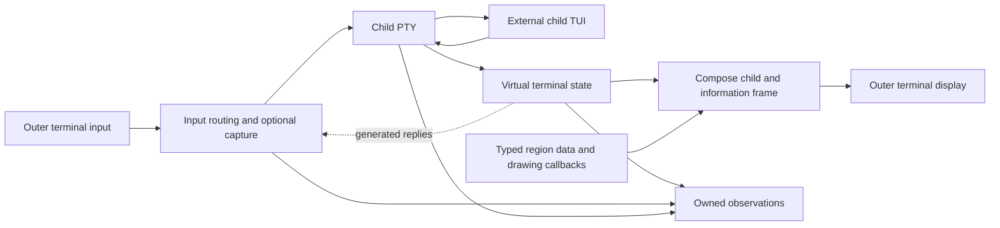

# A virtual terminal makes framing possible

**`go-tui-frame` needs a real child terminal endpoint, a stateful terminal emulator, and a compositor to surround one arbitrary external TUI with consumer information.** Removing pane management does not remove terminal emulation: cursor movement, erase/reset operations, alternate screens, and queries still need a child-local display. The consumer API can remain concise and fluent, with configuration chains ending in a context-aware execution boundary. Default forwarding can preserve uncaptured keyboard and paste bytes when negotiated protocols agree, while mouse coordinates require translation into the framed viewport. Rich observation can cover terminal bytes/state, process lifecycle, and available OS metadata; arbitrary application internals remain inaccessible without cooperation. This report recommends comparing a broad-protocol native stack against a pure Go stack before selecting dependencies. The user confirms the module name `github.com/alexgorbatchev/go-tui-frame` and requests Unix-like systems and macOS, excluding Windows; **all API and runtime contracts here remain proposals**, and no terminal behavior has been implemented or tested. ([PTY semantics](https://man7.org/linux/man-pages/man7/pty.7.html), [terminal controls](https://invisible-island.net/xterm/ctlseqs/ctlseqs.html).)

The user explicitly requests a [README written in present tense as the consumer implementation specification](../README.md). Its API examples and installation command define the target contract; they are not evidence of an existing runtime, a published module, or a successful `go get`. Actual repository state and verification remain recorded here separately.

## One framed child still requires a virtual terminal

A Unix PTY gives the child a terminal slave and the host a master byte transport. It provides native terminal input/output and foreground-process-group semantics, but **it does not confine drawing to a rectangle**. An application can move the cursor absolutely, erase the screen, reset terminal state, or enter another screen buffer. Setting an outer scroll region or repeatedly repainting a header cannot contain all those operations. The resulting architectural inference is a PTY feeding a streaming emulator whose screen is composed with consumer regions by one outer-terminal writer. The child sees the remaining viewport dimensions; the outer terminal sees a complete composed display. ([Linux PTY](https://man7.org/linux/man-pages/man7/pty.7.html), [XTerm controls](https://invisible-island.net/xterm/ctlseqs/ctlseqs.html).)



The child endpoint needs a coherent identity. Its `TERM`, terminfo entry, device attributes, mode responses, size, and input encodings must describe the virtual terminal actually implemented. Inheriting the physical terminal's identity would advertise capabilities that the intermediary cannot necessarily preserve. The frame owns the outer screen; the child's alternate-screen switches remain virtual. Frame callbacks draw into clipped cell canvases for composition, instead of becoming competing writers of terminal escape sequences. These are proposed ownership decisions derived from the stateful terminal protocol. ([terminfo](https://invisible-island.net/ncurses/man/terminfo.5.html), [parser state](https://xtermjs.org/docs/api/terminal/interfaces/iparser/), [kitty screen-specific keyboard state](https://sw.kovidgoyal.net/kitty/keyboard-protocol/).)

Prior art confirms the architecture and supplies API precedents, but **an existing multiplexer application is not an embeddable single-child Go library**. GNU Screen's always-visible caption and hardstatus resemble the requested experience. Its default Ctrl-A command prefix differs from the required uncaptured input. tmux's control mode exports pane output and lifecycle notifications, while Zellij's plugin events provide a useful distinction between state snapshots and event subscriptions. Reusing either application as a mandatory backend would introduce its own server/plugin protocol and session concerns. ([GNU Screen captions](https://www.gnu.org/software/screen/manual/html_node/Caption.html), [hardstatus](https://www.gnu.org/software/screen/manual/html_node/Hardstatus.html), [command character](https://www.gnu.org/software/screen/manual/html_node/Command-Character.html), [tmux control mode](https://github.com/tmux/tmux/wiki/Control-Mode), [Zellij events](https://zellij.dev/documentation/plugin-api-events).)

| Prior art | Relevant contribution | Assessment for this library |
| :--- | :--- | :--- |
| [tmux](https://github.com/tmux/tmux) | PTY/emulator/composition architecture; raw output, notifications, and flow control in control mode | Architectural reference; external C application/server, not a Go dependency |
| [GNU Screen](https://www.gnu.org/software/screen/manual/html_node/Overview.html) | Information surrounding one full-screen program | UX precedent; default key interception differs |
| [Zellij](https://zellij.dev/documentation/plugin-api-events) | Pane/process metadata and event subscriptions | Observation precedent; Rust workspace application/plugin host |
| [TUIOS](https://github.com/Gaurav-Gosain/tuios/blob/main/go.mod) | Current Go application using Ultraviolet, `x/xpty`, and libghostty | Concrete stack adoption; forwarding fidelity remains unproven here |
| [3mux](https://github.com/aaronjanse/3mux/blob/master/go.mod) | Go multiplexer and terminal implementation | Source reference; current module retains Go 1.14 and old dependencies |
| [tvxterm](https://github.com/blacknon/tvxterm) | Embeddable `tview.Primitive`, PTY/stream backends, title and screen state | Closest library precedent; explicitly incomplete emulator and broader dependencies |

`tvxterm` is an instructive contrast rather than the leading dependency. Its README describes a small emulator with incomplete terminal features, and its module includes SSH/NFS/PKCS11-related dependencies alongside tcell v2. The host framework also owns input processing. A concise public API is useful, but neither an embeddable primitive nor a fluent setter chain proves preservation of an arbitrary child's terminal contract. ([tvxterm README](https://github.com/blacknon/tvxterm), [module](https://github.com/blacknon/tvxterm/blob/master/go.mod).)

## Default forwarding preserves bytes but must translate geometry

The proposed default has **no prefix key, pane bindings, automatic quit binding, Escape cancellation, or host-side Ctrl-C/Ctrl-Z interception**. Outer raw mode removes host canonical editing, echo, signal-character handling, and transformations. Bytes written to the child PTY then encounter the child's own slave settings; a child with interrupt handling enabled receives the expected foreground-group signal. Thus the fidelity boundary is the bytes delivered to the child terminal endpoint, not a promise that every application `read` returns the same bytes. ([termios](https://man7.org/linux/man-pages/man3/termios.3.html), [PTY signals](https://man7.org/linux/man-pages/man7/pty.7.html).)

The input router retains original byte slices and uses a streaming classifier only where routing requires it. It does not decode every key into a restricted framework enum and reconstruct it through `x/vt.SendKey`. Matching keyboard and paste protocols permit unchanged delivery. Mode negotiation remains necessary: kitty enhancements distinguish press/repeat/release, modifiers, alternative key identities, and associated text, while xterm's modified-key modes select different encodings. Blind raw input relay cannot make the outer terminal honor modes requested only inside the virtual endpoint. Where protocol conversion is necessary, observation must preserve both original and delivered bytes and the conversion reason. ([kitty keyboard specification](https://sw.kovidgoyal.net/kitty/keyboard-protocol/), [XTerm modified keys](https://invisible-island.net/xterm/modified-keys.html), [x/vt encoder omissions](https://github.com/charmbracelet/x/blob/main/vt/key.go).)

**Mouse bytes cannot universally remain unchanged after the child origin moves.** The router subtracts the viewport origin while preserving button, modifiers, wheel/motion action, and release semantics under the child-selected encoding. X10 and UTF-8 encodings impose coordinate limits; SGR and urxvt have different representations, and SGR-pixel requires measured pixel geometry. Clamping an out-of-range event changes its meaning. A frame location has no valid child-local cell, and a drag beginning inside can finish outside. The outside-viewport and crossing-gesture policy remains a decision for the consumer contract; neither dropping everything nor fabricating edge clicks satisfies the broad forwarding request automatically. ([XTerm tracking and encodings](https://invisible-island.net/xterm/ctlseqs/ctlseqs.html).)

Focus reports and child-visible paste envelopes follow child-selected reporting modes. Recognized bracketed-paste payloads remain opaque to keyboard-capture matching and retain original controls/newlines. Unmarked pasted bytes are indistinguishable from typing, so an optional capture cannot promise to exclude them. Independently requesting outer bracketing and translating only the envelope could strengthen the contract, but that strategy remains unselected. This matters because other embedded-terminal implementations deliberately sanitize paste or omit pixel mouse, demonstrating that similar products choose different fidelity contracts. Optional capture consumes only an explicit consumer decision and records the disposition; `Pass` declines capture and resumes ordinary protocol-aware routing, preserving original bytes when protocols agree. Multi-key capture requires a stated timeout/replay policy because buffering changes latency. Legacy encodings cannot reveal every physical key identity, and shortcuts consumed by the desktop or physical terminal never reach this library. ([XTerm focus/paste](https://invisible-island.net/xterm/ctlseqs/ctlseqs.html#h2-Bracketed-Paste-Mode), [OpenTUI embedded-terminal behavior](https://opentui.com/docs/components/embedded-terminal/), [kitty legacy ambiguities](https://sw.kovidgoyal.net/kitty/keyboard-protocol/).)

The proposed capture payload is `Input{Raw []byte; Key uv.KeyEvent}` for recognized keyboard events, with an owned raw-byte copy and native semantic data. `Capture(func(Input) Disposition)` remains opt-in: `Pass` continues routing, while `Consume` withholds that event and remains observable. The pinned UV interface has `String()` and `Key()`, not `MatchString`; the underlying `uv.Key` provides native matching, so the README uses `input.Key.Key().MatchString("ctrl+q")`. Press and release are distinct event types, and `Key.IsRepeat` is available only under protocols that supply it. These are inspected third-party contracts and a proposed wrapper API, not implemented capture behavior. ([Pinned event types](https://github.com/charmbracelet/ultraviolet/blob/006e29f97886/event.go), [native key fields/matching](https://github.com/charmbracelet/ultraviolet/blob/006e29f97886/key.go).)

The Ctrl-Q example consumes matching events, requests context cancellation for presses including reported repeats, and consumes matching releases without action. It does not install a default binding or add competing terminal writes. Capture classification, fragmentation, repeat/release dispatch, modifier changes across a held key, and any state needed for coherent intercepted gestures must be implemented and tested; native matching alone does not establish those guarantees. Unmatched input follows ordinary routing, and unknown non-key input remains available through raw observation. Recognized paste boundaries retain their exclusion rule. Cancellation requests use the standard context contract; actual child-group shutdown remains the lifecycle work described below. ([Context cancellation](https://pkg.go.dev/context#WithCancel), [kitty phases](https://sw.kovidgoyal.net/kitty/keyboard-protocol/).)

Query handling is another input path, distinct from user activity. The virtual terminal answers its own cursor, size, identity, mode, and capability queries; only physically relevant queries can be proxied. The router correlates the library's outer-terminal queries separately instead of dropping every input sequence that resembles a reply. Some response forms overlap modified-key encodings. Emulator-generated replies must enter the same serialized child writer and appear in the delivered-byte stream with generated provenance. ([XTerm queries and key forms](https://invisible-island.net/xterm/ctlseqs/ctlseqs.html), [x/vt reply pipe](https://github.com/charmbracelet/x/blob/main/vt/emulator.go), [libghostty write effects](https://github.com/mitchellh/go-libghostty/blob/main/terminal.go).)

## Rich observation requires provenance and bounded ownership

The consumer needs **three distinct transport streams**: exact outer input before classification, exact child PTY output before parsing, and successful child-input writes after capture, translation, and replies. Each proposed record carries stream offsets, an observation sequence, timestamps, origins, and dispositions; transformation records link source and delivered ranges. These describe what the library observed, not a perfect ordering of external physical actions. A read can return partial data, and on Unix the slave's output processing has already acted before master-side capture. A shared PTY also merges stdout, stderr, and other terminal writers, so it cannot reliably assign each byte to a descriptor or PID. ([read semantics](https://man7.org/linux/man-pages/man2/read.2.html), [termios output processing](https://man7.org/linux/man-pages/man3/termios.3.html), [PTY](https://man7.org/linux/man-pages/man7/pty.7.html).)

Owned snapshots expose the emulator's current cells, grapheme contents and widths, rendition/colors, hyperlinks, cursor, margins, modes, both screens, scrollback, damage, geometry, and supported protocol state. Events expose bells, title/cwd hints, requests/replies, graphics placements, unsupported operations, routing, and lifecycle. A title or OSC cwd is **child-reported metadata**, not validated application or process state. Launch argv/environment/cwd are configuration; current cwd and foreground job require separate OS observation. Linux `/proc` offers cwd, process/group/session state, and accounting under permission checks. Current macOS inspection still requires implementation-stage investigation. ([Unicode graphemes](https://www.unicode.org/reports/tr29/), [OSC 8](https://gist.github.com/egmontkob/eb114294efbcd5adb1944c9f3cb5feda), [cooperative metadata](https://iterm2.com/documentation-escape-codes.html), [Linux process state](https://man7.org/linux/man-pages/man5/proc_pid_stat.5.html), [cwd](https://man7.org/linux/man-pages/man5/proc_pid_cwd.5.html).)

| Proposed information | Source and qualification |
| :--- | :--- |
| Executable, argv, initial cwd/env | Consumer launch configuration, separately labeled from runtime facts |
| PID, exit/signal, start/wait/drain/cleanup | Native process/backend observations with availability and error state |
| Foreground group and discovered descendants | OS sampling; distinguish the launch leader, active job, and discovery/identity races |
| Runtime cwd, CPU/memory, process state and current slave settings | Platform-specific sampling with source, acquisition time, permission and collection errors |
| Cells, cursor, modes, screens, history, damage | Derived emulator state under an advertised capability profile |
| Title/cwd/host hints and shell marks | Cooperative terminal protocol reports, not independent OS verification |
| Bytes, generated replies and capture/translation | Exact transport observation and successful writes, with offsets and provenance |
| Unsupported controls, denied side effects and losses | Explicit events retaining the request and routing result |

This black-box model cannot inspect arbitrary widget trees, editor buffers, selected domain objects, application network state, or semantic intent. Additional information requires an explicit cooperative protocol. Even OS metadata is sampled and permission-limited; a launch PID need not be the current foreground job, and a reported cwd can describe a remote host. Current slave termios settings can be sampled, but packet mode does not establish a complete history of every settings change. “All details possible” therefore means maximizing available observations and reporting their boundaries rather than inventing unavailable fields. ([foreground-group API](https://man7.org/linux/man-pages/man2/TIOCGPGRP.2const.html), [cwd access](https://man7.org/linux/man-pages/man5/proc_pid_cwd.5.html), [semantic integration](https://iterm2.com/documentation-escape-codes.html), [packet-mode semantics](https://man7.org/linux/man-pages/man2/TIOCPKT.2const.html).)

The proposed ownership model serializes emulator state and child-input writes, copies borrowed dependency views into durable consumer data, and dispatches passive observation separately. Capture decisions are inline and prompt; rendering callbacks return promptly outside locks. Consumers synchronize their own external data. Finite buffers cannot guarantee nonblocking core I/O and lossless delivery to an indefinitely slow observer simultaneously. The proposed `Observe` default therefore reports overflow as an operational failure instead of silently dropping raw bytes; explicit lossless recording can choose backpressure. Live snapshots can coalesce if sequence gaps are visible. Queue sizes, policy configuration, callback error/panic treatment, and final dispatch/drain deadlines remain open. A callback that never returns cannot be forcibly canceled by Go context cancellation. ([parser/backpressure effects](https://xtermjs.org/docs/api/terminal/interfaces/iparser/), [libghostty concurrency and borrowed views](https://github.com/mitchellh/go-libghostty/blob/main/doc.go).)

Lifecycle ownership extends beyond root-process exit. On Unix the session must establish the child controlling terminal and foreground group, set viewport winsize before execution, service I/O, wait once, drain output, close descriptors, and restore owned outer state. Resizing should use native winsize behavior to signal the terminal's foreground group. `exec.CommandContext` defaults to killing the root process; that is not whole-session cleanup. Foreground groups change, and detached descendants can escape them. Cancellation requires defined graceful/forced targets and drain boundaries; suspend/resume requires restoration before stop and re-acquisition/redraw afterward. Cleanup cannot guarantee restoration after an uncatchable kill or machine failure. ([controlling terminal](https://man7.org/linux/man-pages/man2/TIOCSCTTY.2const.html), [Linux resize](https://man7.org/linux/man-pages/man2/TIOCSWINSZ.2const.html), [Apple winsize implementation](https://raw.githubusercontent.com/apple-oss-distributions/xnu/main/bsd/kern/tty.c), [Go cancellation/wait](https://pkg.go.dev/os/exec), [process-group signals](https://man7.org/linux/man-pages/man2/kill.2.html).)

## Established transport leaves a substantial emulator choice

**The recommended Unix transport candidate is `creack/pty`; the leading broad-protocol emulator candidate is libghostty.** `x/vt` is the leading inspected pure Go alternative, but its current modern-keyboard and mouse omissions need substantive protocol work. Ultraviolet and tcell are cell-rendering/input candidates, not replacements for a child emulator. This ranking reflects source inspection, dated adoption/activity observations, license, and fit; **no terminal backend is selected and no dependency is installed or locally tested**. The user's subsequent Charm/Lip Gloss request establishes native Lip Gloss v2 as the target consumer drawing surface. The consulted Go skill requires user dependency selection before imports or implementation. ([creack/pty](https://github.com/creack/pty), [libghostty](https://github.com/mitchellh/go-libghostty), [x/vt defaults](https://github.com/charmbracelet/x/blob/main/vt/handlers.go), [Lip Gloss canvas](https://github.com/charmbracelet/lipgloss/blob/v2.0.6/canvas.go).)

| Layer / suitability rank | Candidate and observed version | License, adoption and activity observed 2026-10-01 | Fit and material tradeoff |
| :--- | :--- | :--- | :--- |
| Unix PTY 1 | [`creack/pty` v1.1.24](https://github.com/creack/pty/releases/tag/v1.1.24), released 2024-10-31 | [MIT; 2,096 stars; push 2026-06-01](https://api.github.com/repos/creack/pty) | Established direct Unix PTY API; no emulator or renderer. Its [example shutdown](https://github.com/creack/pty/blob/master/README.md) is explicitly non-production. |
| Unix PTY 2 | [`x/xpty` v0.1.4](https://proxy.golang.org/github.com/charmbracelet/x/xpty/@latest), dated 2026-07-30 | [MIT; parent x repository 318 stars; push 2026-10-01](https://api.github.com/repos/charmbracelet/x) | PTY abstraction; [Unix session/control-TTY setup and context-aware waiting](https://github.com/charmbracelet/x/blob/main/xpty/pty.go) remain caller responsibilities. Its Windows capability adds no value to the requested scope. |
| Broad-protocol emulator 1 | [`go.mitchellh.com/libghostty`, pseudo-version dated 2026-10-01](https://proxy.golang.org/go.mitchellh.com/libghostty/@latest) | [MIT; mirror 154 stars; push 2026-10-01](https://api.github.com/repos/mitchellh/go-libghostty) | Rich native terminal state/effects and enhanced input; CGO, native library/pkg-config, and unstable binding API. |
| Pure Go emulator 1 | [`x/vt`, pseudo-version dated 2026-10-01](https://proxy.golang.org/github.com/charmbracelet/x/vt/@latest) | [MIT; parent x repository 318 stars; push 2026-10-01](https://api.github.com/repos/charmbracelet/x) | Useful cells/cursor/history/hooks; missing default kitty/modifyOtherKeys negotiation and several mouse encodings. |
| Emulator 3 | [`hinshun/vt10x`, proxy version dated 2022-03-01](https://proxy.golang.org/github.com/hinshun/vt10x/@latest) | [MIT; 51 stars; push 2023-12-06](https://api.github.com/repos/hinshun/vt10x) | Small stateful terminal API; [single-rune glyph model](https://github.com/hinshun/vt10x/blob/master/state.go) and limited observed modern protocol surface. |
| Emulator 4 / watchlist | [`web-terminal-engine/v6` v6.0.1](https://github.com/cplieger/web-terminal-engine/releases/tag/v6.0.1), released 2026-09-20 | [MPL-2.0; 3 stars; push 2026-10-01](https://api.github.com/repos/cplieger/web-terminal-engine) | [State/modes/history and effect drains](https://github.com/cplieger/web-terminal-engine); browser-session scope, low adoption, distinct license implications. |
| Renderer 1 for current Go stack fit | [Ultraviolet, current pseudo-version](https://proxy.golang.org/github.com/charmbracelet/ultraviolet/@latest) | [MIT; 391 stars; push 2026-10-01](https://api.github.com/repos/charmbracelet/ultraviolet) | Cell buffers/diffing/layout; API can change and its terminal abstraction owns input/raw lifecycle. |
| Renderer 2, highest renderer adoption | [`tcell/v3` v3.5.0](https://github.com/gdamore/tcell/releases/tag/v3.5.0), released 2026-09-11 | [Apache-2.0; 5,224 stars; push 2026-09-24](https://api.github.com/repos/gdamore/tcell) | Pure Go renderer, enhanced input and graphemes; event decoding needs deliberate raw-byte ownership. |
| Requested native frame drawing | [`charm.land/lipgloss/v2` v2.0.6](https://github.com/charmbracelet/lipgloss/releases/tag/v2.0.6), released 2026-08-11 | [MIT](https://pkg.go.dev/charm.land/lipgloss/v2); adoption metrics not sampled in this narrow follow-up | Native styles, layers and cell Canvas; [pins Ultraviolet](https://github.com/charmbracelet/lipgloss/blob/v2.0.6/go.mod), does not emulate child terminal output. |
| Optional frame widgets | [`tview` v0.42.0](https://github.com/rivo/tview/releases/tag/v0.42.0), released 2025-08-27 | [MIT; 14,117 stars; push 2026-08-11](https://api.github.com/repos/rivo/tview) | Fluent UI/widget precedent; no child emulator, and current main uses tcell v2. |

Repository stars and last push are **adoption/activity signals, not conformance or submodule maintenance metrics**. Release cadence ranges from older established PTY tags to same-day emulator pseudo-versions, making pinning and compatibility review essential. TUIOS's inspected module provides an adoption example for the libghostty/Ultraviolet/xpty combination, while its 4,446 stars and same-day v0.8.4 application release do not establish library API stability. Issue turnaround was sampled only: Ultraviolet examples closed in roughly 12 and 22 days, and tcell examples in roughly 4 and 23 days. Those four cases do not justify a general responsiveness rating. ([TUIOS module](https://github.com/Gaurav-Gosain/tuios/blob/main/go.mod), [repository metrics](https://api.github.com/repos/Gaurav-Gosain/tuios), [v0.8.4](https://github.com/Gaurav-Gosain/tuios/releases/tag/v0.8.4), [Ultraviolet #189](https://github.com/charmbracelet/ultraviolet/issues/189), [#177](https://github.com/charmbracelet/ultraviolet/issues/177), [tcell #1178](https://github.com/gdamore/tcell/issues/1178), [#1169](https://github.com/gdamore/tcell/issues/1169).)

The dependency comparison has a decisive protocol difference. `x/vt` exposes cells, cursor, alternate screen, history, damage, and callbacks, but its default handlers do not implement kitty CSI-u or `modifyOtherKeys` negotiation. Its key encoder explicitly lists those omissions; the mouse encoder lacks UTF-8, urxvt, SGR-pixel, and highlight handling. Storing a DEC mode in a generic map and reporting it enabled does not establish the mode's behavior. Ultraviolet's ability to decode enhanced keys cannot repair the emulator's missing child-side negotiation. ([x/vt interface](https://github.com/charmbracelet/x/blob/main/vt/terminal.go), [handlers](https://github.com/charmbracelet/x/blob/main/vt/handlers.go), [key encoder](https://github.com/charmbracelet/x/blob/main/vt/key.go), [mouse encoder](https://github.com/charmbracelet/x/blob/main/vt/mouse.go), [mode setter](https://github.com/charmbracelet/x/blob/main/vt/csi_mode.go).)

Libghostty exposes richer state getters, render state, kitty keyboard flags, mouse modes, graphics access, and effect callbacks including writes back to the PTY. Its native parser handles kitty query/push/pop/set operations; its encoder can load state from the terminal. These are inspected capabilities, not an end-to-end result for this library, and they still leave frame coordinate conversion, outer rendering, effects, and cleanup to the host. The Go binding is young, explicitly unstable, and requires CGO plus compatible native libghostty/pkg-config; its source of truth is Tangled rather than the GitHub mirror. Borrowed views and non-concurrent handles need owned copies and serialized access. ([state getters](https://github.com/mitchellh/go-libghostty/blob/main/terminal_data.go), [render state](https://github.com/mitchellh/go-libghostty/blob/main/render_state.go), [native parser](https://github.com/ghostty-org/ghostty/blob/main/src/terminal/stream.zig), [key encoder](https://github.com/mitchellh/go-libghostty/blob/main/key_encoder.go), [binding README](https://github.com/mitchellh/go-libghostty/blob/main/README.md), [ownership contract](https://github.com/mitchellh/go-libghostty/blob/main/doc.go).)

The proposed broad-compatibility path is **creack/pty + libghostty + Ultraviolet composition/rendering, with Lip Gloss for consumer regions**. The pure Go path substitutes **x/vt**, accompanied by substantive protocol implementation and testing to meet the same requested scope. Native Lip Gloss canvases favor Ultraviolet composition; a tcell renderer remains a higher-adoption alternative but requires deliberate cell mapping and input ownership. If the consumer instead chooses a smaller compatibility profile, that is an explicit scope decision rather than a hidden consequence of choosing pure Go. Neither stack can be called arbitrary-TUI transparent today. Raw input ownership must remain deliberate regardless of the renderer, and tview cannot silently be upgraded from its tcell v2 dependency to v3. ([Ultraviolet ownership](https://github.com/charmbracelet/ultraviolet/blob/main/README.md), [Lip Gloss native surface](https://github.com/charmbracelet/lipgloss/blob/v2.0.6/canvas.go), [tcell v3](https://github.com/gdamore/tcell/blob/main/README.md), [tview module](https://github.com/rivo/tview/blob/master/go.mod).)

The narrow Lip Gloss follow-up verifies v2.0.6's module, styles, native Canvas and layer composition without compiling an integration. A Canvas is a real Ultraviolet cell buffer implementing `uv.Screen` and `uv.Drawable`, so consumer callbacks can use native rendering rather than a parallel frame styling API. This does not require a Bubble Tea program or surrender input ownership. The release pins Ultraviolet commit `006e29f97886`; stable claims use that dependency rather than silently substituting main. ([module](https://github.com/charmbracelet/lipgloss/blob/v2.0.6/go.mod), [canvas](https://github.com/charmbracelet/lipgloss/blob/v2.0.6/canvas.go), [UV interfaces](https://github.com/charmbracelet/ultraviolet/blob/006e29f97886/uv.go).)

## A concise Go API still needs explicit execution contracts

The proposed entry point is `New[T any](cmd *exec.Cmd, initial T) *Frame[T]`, using an ordinary Go command and inferred application-data type. **The primary frame API combines native Lip Gloss drawing, owned child snapshots, and typed region payloads into one callback argument, with callbacks last.** `Header(rows int, draw func(DrawContext[T])) *Frame[T]` and `Footer` reserve rows; analogous `Left`/`Right` methods reserve columns. `DrawContext[T]` has exported fields `Term Snapshot`, `View *lipgloss.Canvas`, and `Data T`. `InvalidateHeader(data T) error` and corresponding edge methods push data through the controller created before `Run`, because the returned `Result` arrives after the session exits. Explicit invalidation removes caller-owned mutexes/channels without introducing watch lists or a separate region DSL. Configuration and execution remain fluent. Methods use the controller's existing type parameter; Go infers `T` from the constructor's initial value. Frame symbols are original proposals; standard Go and Lip Gloss signatures are inspected upstream contracts. ([Go type inference](https://go.dev/ref/spec#Type_inference), [generic receiver declarations](https://go.dev/ref/spec#Method_declarations), [Go `exec.Cmd`](https://pkg.go.dev/os/exec#Cmd), [Lip Gloss setters](https://github.com/charmbracelet/lipgloss/blob/v2.0.6/set.go).)

```go
// Proposed API only: no listed go-tui-frame symbol is implemented.
type UIData struct{ Status string }

banner := lipgloss.NewStyle().
    Background(lipgloss.Color("#B91C1C")).
    Foreground(lipgloss.Color("#FFFFFF")).Bold(true).Padding(0, 1)

app := frame.New(exec.Command("nvim", "--clean"), UIData{Status: "Indexing…"}).
    Header(3, func(ctx frame.DrawContext[UIData]) {
        if ctx.View.Bounds().Empty() {
            return
        }
        text := fmt.Sprintf("Editor · PID %d\n%s", ctx.Term.Child.PID, ctx.Data.Status)
        ctx.View.Compose(lipgloss.NewLayer(banner.
            Width(ctx.View.Width()).Height(ctx.View.Height()).
            MaxWidth(ctx.View.Width()).MaxHeight(ctx.View.Height()).Render(text)))
    }).
    Footer(1, func(ctx frame.DrawContext[UIData]) {
        if ctx.View.Bounds().Empty() {
            return
        }
        text := fmt.Sprintf("%s · %d×%d",
            ctx.Term.Terminal.Title, ctx.Term.Viewport.Cols, ctx.Term.Viewport.Rows)
        ctx.View.Compose(lipgloss.NewLayer(lipgloss.NewStyle().
            Foreground(lipgloss.Color("#9CA3AF")).Padding(0, 1).
            Width(ctx.View.Width()).Height(ctx.View.Height()).
            MaxWidth(ctx.View.Width()).MaxHeight(ctx.View.Height()).Render(text)))
    }).
    Border(true)

result, err := app.Run(ctx)
```

From the wrapper's existing indexing-completion event handler, independently of the blocking `Run` call:

```go
err := app.InvalidateHeader(UIData{Status: "Index complete"})
```

Inside the callbacks, `ctx` is the proposed `DrawContext[UIData]`; the outer `ctx` passed to `Run` is the caller's `context.Context`. The drawing context is a data value, not a cancellation interface. `fmt` and `exec` denote standard-library packages, and `lipgloss` is `charm.land/lipgloss/v2`. **External frame information updates while the child is idle** through region-specific invalidation on `app`. Each declaration initially copies the constructor's `T` value into that region; a later header submission does not alter the footer's payload. Invalidation before execution replaces the configured region's initial data. During execution it atomically publishes that region's complete latest payload plus a dirty revision, and `Data` receives a stable by-value payload. Pending submissions coalesce; after producers settle, the latest accepted value reaches the region while the session stays active. A submission racing startup or callback evaluation must schedule the required drawing pass without losing a wakeup. No internal synchronization algorithm is selected by this proposal. ([Go string formatting](https://pkg.go.dev/fmt#Sprintf), [Go command construction](https://pkg.go.dev/os/exec#Command).)

The proposed invalidation methods return `ErrRegionNotConfigured` for an absent region and `ErrSessionClosed` once shutdown begins. Publication and shutdown must have one ordering, preventing calls from reaching released resources. Accepted data is not a paint acknowledgment: shutdown can occur before a queued paint. Invalidation does no terminal I/O and never waits for rendering/callbacks. Every explicit call requests drawing; arbitrary `T` need not be comparable, and no deep-equality or identical-value suppression is promised. Cell diffing suppresses unchanged output instead. These are observable contracts requiring behavior tests, rather than a claim of lock-free publication.

Generic values are copied by value, not deep-cloned: referenced maps, slices and pointers remain shared. Consumers submit immutable owned snapshots and do not mutate referenced contents while the frame may use them; callbacks follow the same rule. The example's struct of strings avoids caller-owned locks. `Term` is separately owned child snapshot data, and grouping it with `Data` does not establish one atomic transaction. `View` remains borrowed only during the callback; retaining the drawing context does not extend that lifetime. This boundary matters more than generic syntax: accepting `any` cannot manufacture ownership of referenced data. ([Go assignment semantics](https://go.dev/ref/spec#Assignment_statements).)

The proposed `View` is a cleared, zero-origin, region-sized native Canvas borrowed for the callback, with child information in `Term`. Native Style width includes padding/borders; height enlarges short content, while positive MaxWidth/MaxHeight cap it. The empty guard matters because zero caps disable limits. The example renders the whole bar with a white-on-red style rather than overwriting its background during text drawing. `Canvas.Compose` accepts one drawable; positioned layers use `NewCompositor(layers...)`, because a layer's own Draw does not apply X/Y/Z. Retaining the canvas, resizing its allocation, or drawing asynchronously is outside the ownership contract. ([native style rendering](https://github.com/charmbracelet/lipgloss/blob/v2.0.6/style.go), [layer composition](https://github.com/charmbracelet/lipgloss/blob/v2.0.6/layer.go).)

Implementation must use the native cell path: paint each local canvas, then draw it into the exact destination rectangle on the final surface, preserving child cells, styles, graphemes, widths and hyperlinks. A narrow area passed to a larger shared screen is insufficient confinement: Compositor.Draw checks overlap without intersecting layer bounds, and StyledString.Draw clears its supplied area. Local canvases provide the paint boundary; wide-cell clipping and destination initialization still need validation. Canvas hardcodes `GraphemeWidth`, whereas its pinned UV buffer defaults to `WcWidth`; the engine must reconcile width policy and terminal negotiation across child and chrome. Standalone Lip Gloss background queries or direct Print calls would compete with terminal ownership and cannot run in paint callbacks. Lip Gloss styled-string parsing is not a child VT emulator. ([UV buffer placement](https://github.com/charmbracelet/ultraviolet/blob/006e29f97886/buffer.go), [cell representation](https://github.com/charmbracelet/ultraviolet/blob/006e29f97886/cell.go), [styled-string drawing](https://github.com/charmbracelet/ultraviolet/blob/006e29f97886/styled.go), [canvas width policy](https://github.com/charmbracelet/lipgloss/blob/v2.0.6/canvas.go), [background query transport](https://github.com/charmbracelet/lipgloss/blob/v2.0.6/terminal.go).)

Rendering follows initial display, explicit region invalidation, relevant child-state changes, or resize; **there is no default 100 ms polling/redraw or periodic frame resnapshot timer**. Normal output diffs composed cells and emits changes, so unchanged content does not repaint. Animation requires explicit consumer scheduling. Drawing callbacks receive owned child snapshots and their region's payload outside state locks; consumers still synchronize foreign mutable state read directly. `Frame[T]` combines declarative configuration with the live controller. Configuration methods cannot be mutated concurrently and freeze when `Run` begins; region invalidation methods alone provide concurrent update submission. No reactive handles, watch tracking, region descriptors, or refresh channels are required by this API.

Before terminal mutation, `Run` validates static requirements: command, positive region allocations, non-nil drawing callbacks, positive initial viewport, compatible stdio/process settings, exclusive outer-terminal ownership, and configured capability profile. It then reversibly acquires the terminal and performs required capability probing before child startup. Runtime query responses can require noncanonical input, so active discovery cannot always complete before any terminal mode change; failed acquisition or verification restores acquired state. The frame executes one session, owns command start/wait and backend I/O, and consumers cannot reuse or concurrently manipulate the accepted command. Conflicting preconfigured stdio or lifecycle attributes produce a configuration error instead of being silently overwritten. The proposed result includes `*os.ProcessState` when the child was started and waited, plus drain/cleanup outcomes; nonzero child exit is distinguished from operational failure. Context handling must be reconciled with command cancellation attributes, not allowed to race a hidden root-kill policy. ([kitty query responses](https://sw.kovidgoyal.net/kitty/keyboard-protocol/#progressive-enhancement), [canonical input](https://man7.org/linux/man-pages/man3/termios.3.html), [Go command reuse, cancellation and wait](https://pkg.go.dev/os/exec#Cmd).)

Compatibility needs a **capability matrix rather than a blanket “all TUIs” claim**. Each capability requires coherent advertisement, parser/state behavior, input and replies, rendering, observation, and cleanup. Unicode requires grapheme/width handling and outer-font limits; OSC 8 requires retained hyperlink attributes. Sixel, kitty graphics, and iTerm images require state, placement/clipping, scroll/erase behavior, ids, replies, and outer capabilities. Raw image passthrough can draw outside the child and does not provide confinement. Clipboard reads/writes, title/cwd requests, notifications, palette/font/window changes, and file transfers need explicit per-operation routing; denied requests remain observable and receive protocol-defined failure replies where available. These areas remain in the requested scope until the user chooses otherwise. ([Unicode width](https://www.unicode.org/reports/tr11/), [OSC 8](https://gist.github.com/egmontkob/eb114294efbcd5adb1944c9f3cb5feda), [kitty graphics](https://sw.kovidgoyal.net/kitty/graphics-protocol/), [sixel specification reproduction](https://manx-docs.org/mirror/vt100.net/docs/vt3xx-gp/chapter14.html), [iTerm images](https://iterm2.com/documentation-images.html), [clipboard responses](https://sw.kovidgoyal.net/kitty/clipboard/).)

| Decision before implementation | Established constraint and unresolved choice |
| :--- | :--- |
| Dependency/native-tool policy | Select broad native stack or pure Go stack; pin actual versions and verify binding/native compatibility, including Lip Gloss's pinned UV version. Native Lip Gloss is the requested consumer surface; no dependencies are added yet. |
| Unix platform coverage | Unix-like systems and macOS are requested; choose concrete platforms/versions and validate controlling-terminal, job-control and metadata behavior. Windows is excluded. |
| Terminal identity and capabilities | Select truthful `TERM`/terminfo/profile and unsupported-operation behavior; enhanced keys, Unicode, graphics, queries and effects cannot be assumed. |
| Pointer boundaries | Define outside-viewport events, drag/release crossing, encoding overflow and unavailable pixel geometry without inventing child coordinates. |
| Layout and resize | Define behavior when frame dimensions leave no positive child viewport during a resize. |
| Effects and graphics | Select per-operation handling for clipboard, title/window/font/palette/notifications/file transfer and retained images, consistent with confinement. |
| Cancellation and ownership | Define graceful/forced targets, detached-descendant boundaries, suspend/resume, output-drain deadline and restoration failures. |
| Observation and callbacks | Finalize schema, retention/queue limits, overflow/backpressure/recording configuration, errors/panics and final dispatcher shutdown. |
| Paste capture boundaries | Recognized bracketed paste bypasses shortcut matching; choose whether independent host bracketing provides exclusion for unmarked child input. |

The implementation validation plan uses real child probes under real PTYs on each supported platform, with red/green behavior tests and deliberate temporary removal of each fix to prove the tests detect it. Required probes cover uncaptured byte fidelity, fragmented controls, frame isolation after erase/reset/alternate-screen operations, negotiated keys, capture matching and original-byte ownership, press/repeat/release and held-modifier behavior, paste boundaries, supported mouse encodings/boundaries, virtual queries, Unicode damage, graphics/effects, allocated canvas geometry, native styled backgrounds and layer positions, region clipping and wide cells, consistent width policy, configuration freeze, region-local payloads before/during Run, immutable-reference ownership, idle-child push updates, coalescing, startup and drawing races, unchanged-cell suppression, absent-region errors, publication/shutdown ordering, rejection after close, observer overflow, foreground-group resize/signals, cancellation, drain and restoration. Scaffold checks cannot replace those tests.

**The completed scaffold contains no runtime API or behavioral tests.** Inspected files are a dependency-free `go.mod` declaring `github.com/alexgorbatchev/go-tui-frame` and Go 1.27.1, package documentation only in `doc.go`, library `justfile` recipes, artifact ignore rules, and Linux/macOS GitHub Actions configuration. The recorded scaffold check ran on `main` before any commits or remotes. The selected local compiler is Go 1.27.1 on darwin/arm64. `just check` exits 0 for module hygiene, build, vet, and race-test commands, with the race test explicitly reporting `[no test files]`; `go list -m all` lists only the main module. The CI workflow is configured but has not run on GitHub. The [exact scaffold execution log](../.tmp/scaffold-checks.log) contains the evidence; its verification boundary is scaffolding, not terminal compatibility, runtime correctness, or performance.

```text
$ just check
just tidy
go mod tidy -diff
just build
go build ./...
just vet
go vet ./...
just test
go test -race ./...
?   	github.com/alexgorbatchev/go-tui-frame	[no test files]
exit_code: 0
```

## Conclusion

The dependency decision determines where the work resides: a richer native emulator reduces protocol implementation but introduces native packaging and a young Go binding; pure Go reduces packaging friction but leaves verified negotiation gaps to resolve. The API can stay compact in either case because child execution, observation, and frame invalidation are the consumer boundaries, while emulator details remain internal. Selecting a dependency does not authorize reducing the requested terminal scope, and a capability advertised to the child becomes a contract that the complete path must satisfy.

This delivery covers the requested scaffold, research, and consumer README specification before runtime implementation. The README intentionally uses present-tense library documentation at the user's request; its examples and installation command remain unimplemented and unexecuted targets. Terminal backend/CGO selection, changes to capability scope, and unresolved user-visible pointer or side-effect semantics require a user decision; buffer limits, schemas, and lifecycle details can be finalized as engineering contracts from verified evidence within the chosen scope. The module name, Unix/macOS direction, native Lip Gloss drawing, a single typed drawing-context argument, callback-last declarations and explicit live-controller invalidation are confirmed; no project license is selected and no dependency is installed. The research establishes design constraints and ranked options, not proof of runtime correctness.
