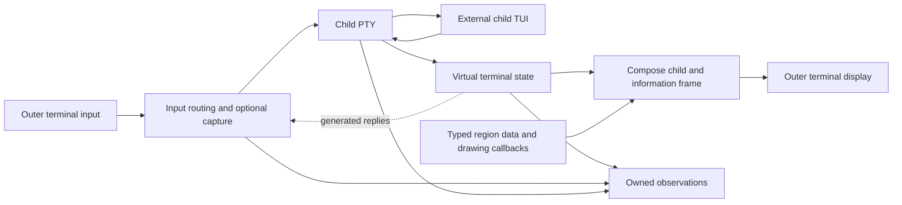

# A virtual terminal makes framing possible

**`go-tui-frame` uses a real child terminal endpoint, a stateful terminal emulator, and a compositor to surround one external TUI with consumer information.** Removing pane management does not remove terminal emulation: cursor movement, erase/reset operations, alternate screens, and queries still need a child-local display. Default forwarding preserves uncaptured keyboard bytes when negotiated protocols agree; mouse coordinates require viewport translation, and paste markers adapt independently of their opaque payload. The user selected **statically linked libghostty**, requiring a standalone wrapper binary without a separately installed native emulator. The confirmed module is `github.com/alexgorbatchev/go-tui-frame`, with Linux/macOS implementation and Windows excluded. **Core configuration/drawing, native emulation, input/capture/routing, bounded observations, and Run exist; real PTY session/CLI tests and macOS/Linux-amd64/Linux-arm64 linkage audits have execution evidence.** Complete arbitrary-TUI fidelity remains unestablished: graphics, richer terminal metadata and platform coverage still have explicit gaps. ([PTY semantics](https://man7.org/linux/man-pages/man7/pty.7.html), [current core](../frame.go), [session](../session.go), [routing](../routing.go), [verification record](../docs/internal/references/verification.md).)

The user explicitly requests a [README written in present tense as the consumer implementation specification](../README.md), subsequently authorizing implementation and the example CLI. The README distinguishes the current supported profile from the broader outstanding specification. The module is published as v1.0.0, without release binaries; a consumer `go get` of it is unverified. Verification is capability-specific.

## One framed child still requires a virtual terminal

A Unix PTY gives the child a terminal slave and the host a master byte transport. It provides native terminal input/output and foreground-process-group semantics, but **it does not confine drawing to a rectangle**. An application can move the cursor absolutely, erase the screen, reset terminal state, or enter another screen buffer. Setting an outer scroll region or repeatedly repainting a header cannot contain all those operations. The resulting architectural inference is a PTY feeding a streaming emulator whose screen is composed with consumer regions by one outer-terminal writer. The child sees the remaining viewport dimensions; the outer terminal sees a complete composed display. ([Linux PTY](https://man7.org/linux/man-pages/man7/pty.7.html), [XTerm controls](https://invisible-island.net/xterm/ctlseqs/ctlseqs.html).)



The child endpoint needs a coherent identity. Its `TERM`, terminfo entry, device attributes, mode responses, size, and input encodings must describe the virtual terminal actually implemented. The current session assigns `TERM=xterm-256color`, `COLORTERM=truecolor`, and removes physical-terminal vendor/graphics hints. The emulator registers no device-attributes handler, so DA queries receive libghostty's defaults (DA1 `CSI ? 62 ; 22 c`: VT220 with ANSI color only, advertising no Sixel or other graphics feature). The frame owns the outer alternate screen; child screen switches remain virtual. Native canvases supply clipped frame drawing without competing terminal writers. ([session environment](../session.go), [native options](../internal/emulator/effects.go), [device attributes](../internal/emulator/terminal.go), [terminfo](https://invisible-island.net/ncurses/man/terminfo.5.html), [kitty screen-specific keyboard state](https://sw.kovidgoyal.net/kitty/keyboard-protocol/).)

Prior art confirms the architecture and supplies API precedents, but **an existing multiplexer application is not an embeddable single-child Go library**. GNU Screen's always-visible caption and hardstatus resemble the requested experience. Its default Ctrl-A command prefix differs from the required uncaptured input. tmux's control mode exports pane output and lifecycle notifications, while Zellij's plugin events provide a useful distinction between state snapshots and event subscriptions. Reusing either application as a mandatory backend would introduce its own server/plugin protocol and session concerns. ([GNU Screen captions](https://www.gnu.org/software/screen/manual/html_node/Caption.html), [hardstatus](https://www.gnu.org/software/screen/manual/html_node/Hardstatus.html), [command character](https://www.gnu.org/software/screen/manual/html_node/Command-Character.html), [tmux control mode](https://github.com/tmux/tmux/wiki/Control-Mode), [Zellij events](https://zellij.dev/documentation/plugin-api-events).)

| Prior art | Relevant contribution | Assessment for this library |
| :--- | :--- | :--- |
| [tmux](https://github.com/tmux/tmux) | PTY/emulator/composition architecture; raw output, notifications, and flow control in control mode | Architectural reference; external C application/server, not a Go dependency |
| [GNU Screen](https://www.gnu.org/software/screen/manual/html_node/Overview.html) | Information surrounding one full-screen program | UX precedent; default key interception differs |
| [Zellij](https://zellij.dev/documentation/plugin-api-events) | Pane/process metadata and event subscriptions | Observation precedent; Rust workspace application/plugin host |
| [TUIOS](https://github.com/Gaurav-Gosain/tuios/blob/main/go.mod) | Current Go application using Ultraviolet, `x/xpty`, and libghostty | Concrete stack adoption; forwarding fidelity remains unproven here |
| [3mux](https://github.com/aaronjanse/3mux/blob/master/go.mod) | Go multiplexer and terminal implementation | Source reference; current module retains Go 1.14 and old dependencies |
| [tvxterm](https://github.com/blacknon/tvxterm) | Embeddable `tview.Primitive`, PTY/stream backends, title and screen state | Closest library precedent; explicitly incomplete emulator and broader dependencies |

`tvxterm` is an instructive contrast rather than the leading dependency. Its README describes a small emulator with incomplete terminal features, and its module includes SSH/NFS/PKCS11-related dependencies alongside tcell v2. The host framework also owns input processing. A concise public API is useful, but neither an embeddable primitive nor a fluent setter chain proves preservation of an arbitrary child's terminal contract. ([tvxterm README](https://github.com/blacknon/tvxterm), [module](https://github.com/blacknon/tvxterm/blob/master/go.mod).)

## Default forwarding preserves bytes but must translate geometry

The implemented default has **no prefix key, pane bindings, automatic quit binding, Escape cancellation, or host-side Ctrl-C/Ctrl-Z interception**. Outer raw mode removes host canonical editing, echo, signal-character handling, and transformations. Bytes written to the child PTY encounter its own slave settings; a child with interrupt handling enabled receives a native foreground-group signal. Fidelity concerns bytes delivered to the child endpoint rather than application `read` boundaries. The example's Ctrl-1 layout, Ctrl-2 header background, Ctrl-3 border and Ctrl-Q bindings are an explicit consumer capture handler. ([capture declaration](../frame.go), [example capture](../cmd/tui-frame/session.go), [termios](https://man7.org/linux/man-pages/man3/termios.3.html).)

The input router retains original byte slices and uses a streaming classifier only where routing requires it. It does not decode every key into a restricted framework enum and reconstruct it through `x/vt.SendKey`. Matching keyboard and paste protocols permit unchanged delivery. Mode negotiation remains necessary: kitty enhancements distinguish press/repeat/release, modifiers, alternative key identities, and associated text, while xterm's modified-key modes select different encodings. Blind raw input relay cannot make the outer terminal honor modes requested only inside the virtual endpoint. Where protocol conversion is necessary, observation must preserve both original and delivered bytes and the conversion reason. ([kitty keyboard specification](https://sw.kovidgoyal.net/kitty/keyboard-protocol/), [XTerm modified keys](https://invisible-island.net/xterm/modified-keys.html), [x/vt encoder omissions](https://github.com/charmbracelet/x/blob/main/vt/key.go).)

**Mouse bytes cannot universally remain unchanged after the child origin moves.** The concrete router uses native encoding after localizing coordinates; outside events are never clamped. A frame-origin press owns no child gesture, and an outside release is discarded rather than inventing an edge cell; this can leave the child's held-button state until a later valid event. Pixel delivery requires measured outer support, with explicit errors for missing precision. Legacy/UTF-8 coordinates beyond 223/2015 fail before native overflow or silent loss. Native UTF-8 Cb is a raw byte, contradicting xterm's UTF-8 Cb requirement for high button codes; invalid reports fail explicitly rather than being rewritten by a parallel encoder. Highlight and buttons 10/11 remain unsupported. Native routing tests cover localized encodings, frame-origin and outside events, measured and missing pixel geometry, coordinate overflow and invalid UTF-8 button codes. ([router](../routing.go), [tests](../routing_test.go), [XTerm tracking and encodings](https://invisible-island.net/xterm/ctlseqs/ctlseqs.html#h2-Extended-coordinates).)

Focus reports follow child-selected reporting. The session independently enables outer bracketed paste when support is observed; the router keeps payload bytes opaque to capture and adjusts only the child's envelope, latching that choice until the closing marker. An outer terminal that sends unmarked paste provides no distinction from typing. `Pass` resumes ordinary protocol-aware routing, preserving original bytes when modes agree. Legacy encodings cannot reveal every physical identity, and desktop/terminal-consumed shortcuts never reach the wrapper. Multi-key capture still requires an explicit timeout/replay contract. ([console negotiation](../console.go), [paste tests](../routing_test.go), [XTerm focus/paste](https://invisible-island.net/xterm/ctlseqs/ctlseqs.html#h2-Bracketed-Paste-Mode), [kitty ambiguities](https://sw.kovidgoyal.net/kitty/keyboard-protocol/).)

The implemented capture payload is `Input{Raw []byte; Key uv.KeyEvent}`, with owned bytes and native semantic data for recognized keys. Capture remains opt-in; native matching is `input.Key.Key().MatchString("ctrl+q")`. Actual negotiated release reporting lets a consumed press own repeats/releases across handler changes while a passed press retains its final release; legacy protocols do not latch. Native framing covers fragmented CSI, ESC-O/C1 SS3, Unicode/Alt keys, paste, 64 parameters, and split string terminators. The session applies a 50 ms deadline only to bare Escape or the two-byte Alt/control-introducer ambiguity, not parameterized fragmented controls or paste. The router compares actually applied outer flags and native child modes, with native encoder observation of hidden modifyOtherKeys state; unknown outer queries use recognized packet wire provenance. Equal active Kitty flags take precedence over legacy mode differences. ([capture](../capture.go), [framing](../internal/input/framer.go), [session](../session.go), [native encoding](../internal/emulator/encoding.go), [routing tests](../routing_test.go).)

Recognized cursor/keypad wire forms supplement unreported outer modes: actual native SS3 keypad input proves effective application mode rather than numeric mode 1035. Routing tests convert SS3 and C1 keypad 0 and SS3 Enter for a child in numeric keypad mode; encoding still uses the selected native encoder. Matching application-keypad wire bytes, including C1 SS3, remain unchanged. ([routing tests](../routing_test.go).)

Explicit Capture retains native Kitty escape-code disambiguation on a verified supporting outer terminal, even when the child uses legacy input. Without Kitty, actually queried modifyOtherKeys support supplies mode 2. The no-capture path remains tied to the child's requested flags. Native conversion delivers unmatched enhanced input in the child's protocol; legacy Ctrl-1/plain digit, Ctrl-2/NUL and Ctrl-3/Escape are not guessed into shortcut identities. Tests inspect the native outer's applied/restored flags for capture on/off and child protocol combinations. ([negotiation](../console.go), [native mode tests](../console_test.go), [Kitty disambiguation](https://sw.kovidgoyal.net/kitty/keyboard-protocol/#disambiguate-escape-codes).)

The Ctrl-Q specification example consumes matching events, requests context cancellation for presses including reported repeats, and consumes matching releases without action. It installs no default binding or competing terminal writes. Core tests verify capture byte ownership, paste exclusion, consumed repeats/releases across modifier changes, and passed-release ownership; native matching alone does not establish end-to-end negotiation or delivery. Unmatched and unknown non-key input retains its ordinary routing contract. Child-group shutdown follows the lifecycle described below. ([capture tests](../capture_test.go), [context cancellation](https://pkg.go.dev/context#WithCancel), [kitty phases](https://sw.kovidgoyal.net/kitty/keyboard-protocol/).)

Query handling is another input path, distinct from user activity. The virtual terminal answers its own cursor, size, identity, mode, and capability queries; only physically relevant queries can be proxied. The router correlates the library's outer-terminal queries separately instead of dropping every input sequence that resembles a reply. Some response forms overlap modified-key encodings. Emulator-generated replies must enter the same serialized child writer and appear in the delivered-byte stream with generated provenance. ([XTerm queries and key forms](https://invisible-island.net/xterm/ctlseqs/ctlseqs.html), [x/vt reply pipe](https://github.com/charmbracelet/x/blob/main/vt/emulator.go), [libghostty write effects](https://github.com/mitchellh/go-libghostty/blob/main/terminal.go).)

## Rich observation requires provenance and bounded ownership

The consumer receives **three distinct transport streams**: exact outer input before classification, child PTY output before parsing, and successful child-input writes after capture, translation, and replies. `Event` carries per-stream offsets, a session sequence, timestamps, origin, and disposition. Explicit source-to-delivered range linkage remains richer provenance work; existing origins do not reconstruct physical-action ordering. Reads can be partial, Unix slave output processing has already occurred, and a shared PTY merges stdout/stderr/other writers without reliable descriptor or writer-PID attribution. ([events](../types.go), [successful-write recording](../session.go), [read semantics](https://man7.org/linux/man-pages/man2/read.2.html), [PTY](https://man7.org/linux/man-pages/man7/pty.7.html).)

The actual native snapshot owns **active viewport** cells/graphemes/widths, native cell style including observed overline, rendered UV style/colors/hyperlink URLs, cursor, alternate-screen selection, named modes with getter errors, Kitty/modifyOtherKeys state, scrollback counts/limits, parser/memory state, and geometry. It does **not** expose both full screen buffers, full scrollback contents, margins or damage records. Native effects expose replies, bells, title/cwd, progress, notifications, shell marks, clipboard and available unknown sequences; unknown callbacks are not an exhaustive control audit. Raw admitted child-output events retain transport. Current OS data is separate: ChildSnapshot exposes OperatingSystem, SessionProcesses, SessionError and PTY, sampled during relevant drawing/explicit invalidation without a metadata timer. Fields preserve native source, availability, error and observation time. ([native state](../internal/emulator/state.go), [effects](../internal/emulator/effects.go), [public fields](../types.go), [event-driven acquisition](../metadata.go).)

Darwin uses native libproc/sysctl, Linux procfs/syscalls. Parent/session/group identity, runtime paths, kernel argv/env views, CPU/RSS/virtual bytes/threads and available counters are owned observations. Native PTY reads capture winsize/termios/foreground group. Reads are sequential with start-identity reuse checks, not a joint atomic process transaction. Linux RSS is approximate, environ is the exec-image memory view, and each procfs file has a 16 MiB acquisition limit; Darwin may omit environment, reported unavailable rather than guessed empty. Clone separates arrays/maps/PTY values; errors and ProcessState are retained read-only. Real native tests cover multiple session groups, changed runtime cwd and copy ownership. Linux amd64/arm64 process test binaries compile but have not executed locally. ([process source](../internal/process/snapshot.go), [Darwin reader](../internal/process/read_darwin.go), [Linux reader](../internal/process/read_linux.go), [process tests](../internal/process/snapshot_test.go), [Linux environ](https://man7.org/linux/man-pages/man5/proc_pid_environ.5.html), [Apple interface](https://github.com/apple-oss-distributions/xnu/blob/main/libsyscall/wrappers/libproc/libproc.h).)

After Wait reaps the launch leader, `OperatingSystem` retains that leader's last running sample, qualified by its own `ObservedAt`. Session members and PTY state continue sampled during drain and immediately before Exited. ([metadata sampling](../metadata.go), [reaping](../session.go).)

| Information family | Source and qualification |
| :--- | :--- |
| Executable, argv, initial cwd/env | Consumer launch configuration, separately labeled from runtime facts |
| PID, exit/signal, start/wait/drain/cleanup | Native process/backend observations with availability and error state |
| Foreground group and discovered descendants | OS sampling; distinguish the launch leader, active job, and discovery/identity races |
| Runtime cwd, CPU/memory, process state and current slave settings | Platform-specific sampling with source, acquisition time, permission and collection errors |
| Active cells/cursor/modes, screen selection, history counts | Owned native snapshot; complete buffers/history, margins and damage remain required extensions |
| Title/cwd/host hints and shell marks | Cooperative terminal protocol reports, not independent OS verification |
| Bytes, generated replies and capture/translation | Exact transport observation and successful writes, with offsets and provenance |
| Unsupported controls, denied side effects and losses | Explicit events retaining the request and routing result |

This black-box model cannot inspect arbitrary widget trees, editor buffers, selected domain objects, application network state, or semantic intent. Additional information requires an explicit cooperative protocol. Even OS metadata is sampled and permission-limited; a launch PID need not be the current foreground job, and a reported cwd can describe a remote host. Current slave termios settings can be sampled, but packet mode does not establish a complete history of every settings change. “All details possible” therefore means maximizing available observations and reporting their boundaries rather than inventing unavailable fields. ([foreground-group API](https://man7.org/linux/man-pages/man2/TIOCGPGRP.2const.html), [cwd access](https://man7.org/linux/man-pages/man5/proc_pid_cwd.5.html), [semantic integration](https://iterm2.com/documentation-escape-codes.html), [packet-mode semantics](https://man7.org/linux/man-pages/man2/TIOCPKT.2const.html).)

The session serializes native state and child-input writes, copies borrowed values for callbacks, and dispatches passive observation separately. Its dispatcher admits 64 waiting events plus one active callback against a combined 16 MiB weighted budget. Overflow returns `ErrObservationOverflow`; immutable admitted weights survive consumer mutation. Close drains admitted events and joins the worker after terminal restoration. These are admission bounds, not exact heap usage or consumer-retained memory. There is no implemented observer snapshot-coalescing policy or source-range linkage to claim. CloneState/CloneEffect separate mutable maps, cells and effect payloads, with immutable color values and native value snapshots. Cell colors are RGBA, except that on 256- and 16-color outer profiles unchanged host-reported palette entries (entries 0–15 only on 16 colors) are `ansi.BasicColor`/`ansi.IndexedColor` indexes whose RGB lives in the native palette. A Go callback that never returns cannot be forcibly canceled. ([dispatcher](../observation.go), [ownership tests](../observation_test.go), [native cloning](../internal/emulator/ownership.go), [restoration test](../session_test.go).)

Lifecycle ownership extends beyond root-process exit. Native PTY startup establishes the child session/controlling terminal and viewport size; winsize updates signal the terminal's foreground job natively. The runtime owns Wait. Cancellation inventories groups in the child session, sends SIGTERM/SIGCONT, then SIGKILL after one second; cleanup inventories again even after the leader exits. Reaping starts a two-second output-drain deadline. Actual tests cover a leader plus another native group and restoration before slow-observer drain. Inventory and signaling race membership changes, detached sessions are excluded, and wrapper suspend/resume is unimplemented. Uncatchable kills/machine failure cannot guarantee restoration. ([session](../session.go), [native groups](../internal/process/groups.go), [session tests](../session_test.go), [PTY startup](https://github.com/creack/pty/blob/v1.1.24/start.go), [native winsize](https://man7.org/linux/man-pages/man2/TIOCSWINSZ.2const.html), [Go command ownership](https://pkg.go.dev/os/exec#Cmd).)

## Selected native stack and build-time requirements

**The selected stack uses `creack/pty` v1.1.24 and statically linked `go.mitchellh.com/libghostty` v0.0.0-20261001181910-76867c77a212**, alongside Ultraviolet drawing/input and optional Lip Gloss demo styling. These pins are installed and used in actual native/session tests. `x/vt` remains the inspected pure Go alternative with verified modern-input gaps; renderer/input libraries do not replace an emulator. The comparison records source inspection, dated adoption/activity, licenses and fit rather than complete conformance. ([dependencies](../go.mod), [creack/pty](https://github.com/creack/pty), [pinned binding](https://github.com/mitchellh/go-libghostty/tree/76867c77a212), [x/vt defaults](https://github.com/charmbracelet/x/blob/main/vt/handlers.go).)

The binding's default `!dynamic` build requests `pkg-config --static libghostty-vt-static` and defines `GHOSTTY_STATIC`. Native Ghostty pin `33da6848d63b3bba2b4f31ab1531d618f2795192` requires Zig 0.16.0. Consumer builds need CGO, a C compiler, `pkg-config`, and matching native headers/archive. Actual macOS-arm64 artifacts import only OS-provided libresolv/libSystem; Linux-amd64 and Linux-arm64 musl ELFs have no imported libraries or PT_INTERP. These audits establish no extra libghostty runtime dependency for those built artifacts, not arbitrary architecture or Linux runtime conformance. Final artifacts require rebuilding/auditing after further source changes. ([build setup](../docs/internal/references/native-build.md), [static directives](https://github.com/mitchellh/go-libghostty/blob/76867c77a212/cgo_static.go), [Zig requirement](https://github.com/ghostty-org/ghostty/blob/33da6848d63b3bba2b4f31ab1531d618f2795192/build.zig.zon), [artifact assertions](../cmd/tui-frame/linkage_test.go), [verification record](../docs/internal/references/verification.md).)

| Layer / suitability rank | Candidate and observed version | License, adoption and activity observed 2026-10-01 | Fit and material tradeoff |
| :--- | :--- | :--- | :--- |
| Unix PTY 1 | [`creack/pty` v1.1.24](https://github.com/creack/pty/releases/tag/v1.1.24), released 2024-10-31 | [MIT; 2,096 stars; push 2026-06-01](https://api.github.com/repos/creack/pty) | Established direct Unix PTY API; no emulator or renderer. Its [example shutdown](https://github.com/creack/pty/blob/master/README.md) is explicitly non-production. |
| Unix PTY 2 | [`x/xpty` v0.1.4](https://proxy.golang.org/github.com/charmbracelet/x/xpty/@latest), dated 2026-07-30 | [MIT; parent x repository 318 stars; push 2026-10-01](https://api.github.com/repos/charmbracelet/x) | PTY abstraction; [Unix session/control-TTY setup and context-aware waiting](https://github.com/charmbracelet/x/blob/main/xpty/pty.go) remain caller responsibilities. Its Windows capability adds no value to the requested scope. |
| Broad-protocol emulator 1 | [`go.mitchellh.com/libghostty`, pseudo-version dated 2026-10-01](https://proxy.golang.org/go.mitchellh.com/libghostty/@latest) | [MIT; mirror 154 stars; push 2026-10-01](https://api.github.com/repos/mitchellh/go-libghostty) | Rich native terminal state/effects and enhanced input; CGO, native library/pkg-config, and unstable binding API. |
| Pure Go emulator 1 | [`x/vt`, pseudo-version dated 2026-10-01](https://proxy.golang.org/github.com/charmbracelet/x/vt/@latest) | [MIT; parent x repository 318 stars; push 2026-10-01](https://api.github.com/repos/charmbracelet/x) | Useful cells/cursor/history/hooks; missing default kitty/modifyOtherKeys negotiation and several mouse encodings. |
| Emulator 3 | [`hinshun/vt10x`, proxy version dated 2022-03-01](https://proxy.golang.org/github.com/hinshun/vt10x/@latest) | [MIT; 51 stars; push 2023-12-06](https://api.github.com/repos/hinshun/vt10x) | Small stateful terminal API; [single-rune glyph model](https://github.com/hinshun/vt10x/blob/master/state.go) and limited observed modern protocol surface. |
| Emulator 4 / watchlist | [`web-terminal-engine/v6` v6.0.1](https://github.com/cplieger/web-terminal-engine/releases/tag/v6.0.1), released 2026-09-20 | [MPL-2.0; 3 stars; push 2026-10-01](https://api.github.com/repos/cplieger/web-terminal-engine) | [State/modes/history and effect drains](https://github.com/cplieger/web-terminal-engine); browser-session scope, low adoption, distinct license implications. |
| Renderer 1 for current Go stack fit | [Ultraviolet, current pseudo-version](https://proxy.golang.org/github.com/charmbracelet/ultraviolet/@latest) | [MIT; 391 stars; push 2026-10-01](https://api.github.com/repos/charmbracelet/ultraviolet) | Cell buffers/diffing/layout; API can change and its terminal abstraction owns input/raw lifecycle. |
| Renderer 2, highest renderer adoption | [`tcell/v3` v3.5.0](https://github.com/gdamore/tcell/releases/tag/v3.5.0), released 2026-09-11 | [Apache-2.0; 5,224 stars; push 2026-09-24](https://api.github.com/repos/gdamore/tcell) | Pure Go renderer, enhanced input and graphemes; event decoding needs deliberate raw-byte ownership. |
| Requested native frame drawing | [`charm.land/lipgloss/v2` v2.0.6](https://github.com/charmbracelet/lipgloss/releases/tag/v2.0.6), released 2026-08-11 | [MIT](https://pkg.go.dev/charm.land/lipgloss/v2); adoption metrics not sampled in this narrow follow-up | Native styles, layers and cell Canvas; [pins Ultraviolet](https://github.com/charmbracelet/lipgloss/blob/v2.0.6/go.mod), does not emulate child terminal output. |
| Optional frame widgets | [`tview` v0.42.0](https://github.com/rivo/tview/releases/tag/v0.42.0), released 2025-08-27 | [MIT; 14,117 stars; push 2026-08-11](https://api.github.com/repos/rivo/tview) | Fluent UI/widget precedent; no child emulator, and current main uses tcell v2. |

Repository stars and last push are **adoption/activity signals, not conformance or submodule maintenance metrics**. Release cadence ranges from older established PTY tags to same-day emulator pseudo-versions, making pinning and compatibility review essential. TUIOS's inspected module provides an adoption example for the libghostty/Ultraviolet/xpty combination, while its 4,446 stars and same-day v0.8.4 application release do not establish library API stability. Issue turnaround was sampled only: Ultraviolet examples closed in roughly 12 and 22 days, and tcell examples in roughly 4 and 23 days. Those four cases do not justify a general responsiveness rating. ([TUIOS module](https://github.com/Gaurav-Gosain/tuios/blob/main/go.mod), [repository metrics](https://api.github.com/repos/Gaurav-Gosain/tuios), [v0.8.4](https://github.com/Gaurav-Gosain/tuios/releases/tag/v0.8.4), [Ultraviolet #189](https://github.com/charmbracelet/ultraviolet/issues/189), [#177](https://github.com/charmbracelet/ultraviolet/issues/177), [tcell #1178](https://github.com/gdamore/tcell/issues/1178), [#1169](https://github.com/gdamore/tcell/issues/1169).)

The dependency comparison has a decisive protocol difference. `x/vt` exposes cells, cursor, alternate screen, history, damage, and callbacks, but its default handlers do not implement kitty CSI-u or `modifyOtherKeys` negotiation. Its key encoder explicitly lists those omissions; the mouse encoder lacks UTF-8, urxvt, SGR-pixel, and highlight handling. Storing a DEC mode in a generic map and reporting it enabled does not establish the mode's behavior. Ultraviolet's ability to decode enhanced keys cannot repair the emulator's missing child-side negotiation. ([x/vt interface](https://github.com/charmbracelet/x/blob/main/vt/terminal.go), [handlers](https://github.com/charmbracelet/x/blob/main/vt/handlers.go), [key encoder](https://github.com/charmbracelet/x/blob/main/vt/key.go), [mouse encoder](https://github.com/charmbracelet/x/blob/main/vt/mouse.go), [mode setter](https://github.com/charmbracelet/x/blob/main/vt/csi_mode.go).)

Libghostty exposes richer state getters, render state, kitty keyboard flags, mouse modes, graphics access, and effect callbacks including writes back to the PTY. Its native parser handles kitty query/push/pop/set operations; its encoder can load state from the terminal. These are inspected capabilities, not an end-to-end result for this library, and they still leave frame coordinate conversion, outer rendering, effects, and cleanup to the host. The Go binding is young, explicitly unstable, and requires CGO plus compatible native libghostty/pkg-config; its source of truth is Tangled rather than the GitHub mirror. Borrowed views and non-concurrent handles need owned copies and serialized access. ([state getters](https://github.com/mitchellh/go-libghostty/blob/main/terminal_data.go), [render state](https://github.com/mitchellh/go-libghostty/blob/main/render_state.go), [native parser](https://github.com/ghostty-org/ghostty/blob/main/src/terminal/stream.zig), [key encoder](https://github.com/mitchellh/go-libghostty/blob/main/key_encoder.go), [binding README](https://github.com/mitchellh/go-libghostty/blob/main/README.md), [ownership contract](https://github.com/mitchellh/go-libghostty/blob/main/doc.go).)

The selected stack has concrete gaps: graphics are not rasterized or advertised via DA. Native Kitty graphics is explicitly disabled through SetKittyImageStorageLimit(nil), preventing its positive query reply across reset/alternate-screen operations; a regression first exposed that reply despite the missing renderer. Ghostty lacks Sixel, and iTerm images remain unestablished. Mouse highlight and buttons 10/11 are unsupported; invalid native UTF-8 button reports fail explicitly. Native overline is observed but omitted from UV rendering; hyperlink URLs lack exposed OSC 8 parameters/ids. Out-of-allocation DECCOLM returns public GeometryError/ErrGeometry instead of silently clipping or resizing the host. These gaps do not fulfill the whole arbitrary-TUI goal; completing or narrowing them requires an explicit scope decision. ([native profile](../internal/emulator/terminal.go), [native state](../internal/emulator/state.go), [geometry](../internal/emulator/geometry.go), [public aliases](../types.go), [Sixel decision](https://github.com/ghostty-org/ghostty/discussions/2496), [UV style](https://github.com/charmbracelet/ultraviolet/blob/006e29f97886/cell.go).)

The selected broad-compatibility path is **creack/pty + libghostty + Ultraviolet composition/rendering, with optional Lip Gloss styling for consumer regions**. The researched pure Go path would substitute **x/vt** and require substantive protocol work to meet the same requested scope. Native Lip Gloss canvases favor Ultraviolet composition; a tcell renderer is a higher-adoption alternative requiring deliberate cell mapping and input ownership. Dependency selection does not reduce the requested compatibility scope. Neither stack is established as arbitrary-TUI transparent here. Raw input ownership must remain deliberate regardless of the renderer, and tview cannot silently be upgraded from its tcell v2 dependency to v3. ([Ultraviolet ownership](https://github.com/charmbracelet/ultraviolet/blob/main/README.md), [Lip Gloss native surface](https://github.com/charmbracelet/lipgloss/blob/v2.0.6/canvas.go), [tcell v3](https://github.com/gdamore/tcell/blob/main/README.md), [tview module](https://github.com/rivo/tview/blob/master/go.mod).)

Lip Gloss v2.0.6 is the demo's optional styling library. Its layers/compositors accept the public `uv.Screen` contract directly; no adapter or frame styling API is required. Core region buffers, border glyphs, and production dependencies are independent of Lip Gloss. Lip Gloss v2.0.6 requires Ultraviolet `006e29f97886`. This module requires upstream Ultraviolet `878653296cfd` and replaces it with the `alexgorbatchev/ultraviolet` fork at `0ff1fafbd555`, that commit plus a Kitty alternate-key decoder fix and a `MatchString` that ignores lock states a binding does not name, except Caps Lock on a key whose text has a character that `unicode.ToUpper` and `unicode.ToLower` map to different runes, so the demo builds against the fork. ([demo](../cmd/tui-frame/demo.go), [core drawing](../layout.go), [border](../composition.go), [module](../go.mod), [UV interfaces](https://github.com/charmbracelet/ultraviolet/blob/878653296cfd/uv.go).)

## A concise Go API still needs explicit execution contracts

The implemented constructor is `New[T any](cmd *exec.Cmd, initial T) *Frame[T]`, with inferred application data. **Frame callbacks combine native drawing, child snapshots and typed payload in one argument, with callbacks last.** `Header(rows int, draw func(DrawContext[T])) *Frame[T]` and Footer reserve rows; Left/Right reserve columns. DrawContext has `Term Snapshot`, `View uv.Screen`, `Data T`. Region invalidations publish through the controller created before blocking Run, whose result arrives after exit. Terminal selects borrowed files, defaulting to stdin/stdout; Run restores acquired state without closing caller files. All these declarations and Run exist, avoiding manual mutex/channel plumbing, watches or a bespoke region DSL. ([core](../frame.go), [session](../session.go), [Go inference](https://go.dev/ref/spec#Type_inference), [generic receivers](https://go.dev/ref/spec#Method_declarations).)

```go
// Consumer example; same native regions are exercised by the example CLI.
type UIData struct{ Status string }

banner := lipgloss.NewStyle().
    Background(lipgloss.Color("#B91C1C")).
    Foreground(lipgloss.Color("#FFFFFF")).Bold(true).Padding(0, 1)

app := frame.New(exec.Command("nvim", "--clean"), UIData{Status: "Indexing…"}).
    Header(3, func(ctx frame.DrawContext[UIData]) {
        if ctx.View.Bounds().Empty() {
            return
        }
        text := fmt.Sprintf("Editor · PID %d\n%s", ctx.Term.Child.PID, ctx.Data.Status)
        lipgloss.NewLayer(banner.
            Width(ctx.View.Bounds().Dx()).Height(ctx.View.Bounds().Dy()).
            MaxWidth(ctx.View.Bounds().Dx()).MaxHeight(ctx.View.Bounds().Dy()).Render(text)).Draw(ctx.View, ctx.View.Bounds())
    }).
    Footer(1, func(ctx frame.DrawContext[UIData]) {
        if ctx.View.Bounds().Empty() {
            return
        }
        text := fmt.Sprintf("%s · %d×%d",
            ctx.Term.Terminal.Title, ctx.Term.Viewport.Cols, ctx.Term.Viewport.Rows)
        lipgloss.NewLayer(lipgloss.NewStyle().
            Foreground(lipgloss.Color("#9CA3AF")).Padding(0, 1).
            Width(ctx.View.Bounds().Dx()).Height(ctx.View.Bounds().Dy()).
            MaxWidth(ctx.View.Bounds().Dx()).MaxHeight(ctx.View.Bounds().Dy()).Render(text)).Draw(ctx.View, ctx.View.Bounds())
    }).
    Border(true)

result, err := app.Run(ctx)
```

From the wrapper's existing indexing-completion event handler, independently of the blocking `Run` call:

```go
err := app.InvalidateHeader(UIData{Status: "Index complete"})
```

Inside callbacks ctx is DrawContext; outer ctx for Run is context.Context. `fmt`/`exec` are standard library; native Lip Gloss is `charm.land/lipgloss/v2`. **External frame information updates while the child is idle** by region-local publication. Each declaration copies initial T; header invalidation leaves footer data unchanged. A mutex publishes data/dirty state; a coalesced wake interrupts the session poll. Drawing clears dirty before callbacks outside the lock, retaining racing updates. Core tests cover coalescing and a blocked callback; real PTY tests cover idle-child push rendering. ([publication](../frame.go), [drawing](../layout.go), [core tests](../frame_test.go), [real session tests](../session_test.go).)

`Border(enabled)` configures the initial one-cell inset; `SetBorder(enabled) error` accepts concurrent changes before/during Run. Region row/column reservations remain fixed. Under the publication lock, requests retain the latest border value and wake the owner without terminal I/O or painting waits. The session applies changed layout on wake and around input routing, resizes native cells and the real child PTY, then recomputes routing coordinates. Border-only changes preserve measured cell pixels even when outer winsize lacks pixel dimensions. Closure returns ErrSessionClosed; an accepted inset that cannot fit produces ErrViewportTooSmall through Run. Border tests cover changes before and during Run and rejection after close; a real native/PTY session verifies both inset sizes and the preserved cell pixels. ([controller](../frame.go), [owned geometry](../session.go), [border tests](../border_test.go).)

Invalidations return ErrRegionNotConfigured for an absent region and ErrSessionClosed after controller close, ordered under the publication mutex. Teardown must close the controller before resource release; that ordering is part of current independent session review. Acceptance publishes data, not a paint acknowledgement; shutdown can precede drawing. Invalidation does no terminal I/O or callback wait and requires no comparable T/deep equality. The integrated UV renderer performs cell diffs; real session tests exercise idle updates and composed output, without claiming every rendering optimization is exhaustively verified.

Generic values are copied by value, not deep-cloned: referenced maps, slices and pointers remain shared. Consumers submit immutable owned snapshots and do not mutate referenced contents while the frame may use them; callbacks follow the same rule. The example's struct of strings avoids caller-owned locks. `Term` is separately owned child snapshot data, and grouping it with `Data` does not establish one atomic transaction. `View` remains borrowed only during the callback; retaining the drawing context does not extend that lifetime. This boundary matters more than generic syntax: accepting `any` cannot manufacture ownership of referenced data. ([Go assignment semantics](https://go.dev/ref/spec#Assignment_statements).)

Each drawing callback's `View` is a cleared, zero-origin, region-sized `uv.Screen`, with child information in `Term`. The core allocates a native `uv.ScreenBuffer` with explicit `ansi.GraphemeWidth`; dimensions come from `Bounds().Dx()/Dy()`. Lip Gloss is optional: native layers/compositors draw directly to that screen, while consumers can also use cell access or other UV drawables. The demo sizes styles to the allocation and uses positive caps; retaining the borrowed screen or drawing asynchronously violates the callback contract. ([screen contract](../types.go), [allocation](../layout.go), [demo](../cmd/tui-frame/demo.go), [native layers](https://github.com/charmbracelet/lipgloss/blob/v2.0.6/layer.go).)

The compositor copies native cell content, styles, widths and hyperlinks into reserved allocations. It clears prior composed cells, restores cached frame content, and copies the available child viewport with partial-wide-glyph clipping. Tests verify region isolation, filled styled backgrounds, stale child-cell removal, and progress for invalid widths. Local canvases remain necessary: Compositor.Draw checks overlap without intersecting layer bounds, and StyledString.Draw clears its supplied area. Region buffers explicitly use `GraphemeWidth` rather than UV's default `WcWidth`; the selected backend/final renderer reconciles width policy and terminal negotiation. Standalone background queries and direct Print calls would compete with terminal ownership; styled-string parsing cannot replace a child emulator. ([composition](../composition.go), [composition tests](../composition_test.go), [region tests](../frame_test.go), [UV placement](https://github.com/charmbracelet/ultraviolet/blob/006e29f97886/buffer.go), [native styled drawing](https://github.com/charmbracelet/ultraviolet/blob/006e29f97886/styled.go), [canvas width](https://github.com/charmbracelet/lipgloss/blob/v2.0.6/canvas.go), [query transport](https://github.com/charmbracelet/lipgloss/blob/v2.0.6/terminal.go).)

The session renders after initial display, explicit invalidation, child-state changes or resize; **there is no default 100 ms frame polling/redraw or periodic resnapshot timer**. Animation needs explicit consumer scheduling. Drawing receives copied snapshots and payloads outside locks; foreign mutable state remains the consumer's responsibility. Frame combines frozen region configuration with concurrent invalidation and SetBorder requests. Escape, synchronized-output and teardown deadlines are protocol/lifecycle work, not a frame-content ticker.

Run validates static command/layout requirements, verifies input/output refer to one interactive terminal, acquires one process-local device owner, and enters raw mode reversibly for capability queries. The outer terminal must report mode 1049 reset; a preexisting alternate screen is rejected because its content cannot be reconstructed. Unobserved optional modes are not mutated. Child startup follows required verification; errors restore acquired termios/modes. Run owns start/wait and I/O, returning child ProcessState separately from drain/cleanup/session errors. A shrinking outer viewport fails explicitly with ErrViewportTooSmall. ([validation](../validation.go), [console acquisition](../console.go), [session](../session.go), [query tests](../console_test.go), [Go command ownership](https://pkg.go.dev/os/exec#Cmd).)

Compatibility needs a **capability matrix rather than a blanket “all TUIs” claim**. Each capability requires coherent advertisement, parser/state behavior, input and replies, rendering, observation, and cleanup. Unicode requires grapheme/width handling and outer-font limits; OSC 8 requires retained hyperlink attributes. Sixel, kitty graphics, and iTerm images require state, placement/clipping, scroll/erase behavior, ids, replies, and outer capabilities. Raw image passthrough can draw outside the child and does not provide confinement. Clipboard reads/writes, title/cwd requests, notifications, palette/font/window changes, and file transfers need explicit per-operation routing; denied requests remain observable and receive protocol-defined failure replies where available. These areas remain in the requested scope until the user chooses otherwise. ([Unicode width](https://www.unicode.org/reports/tr11/), [OSC 8](https://gist.github.com/egmontkob/eb114294efbcd5adb1944c9f3cb5feda), [kitty graphics](https://sw.kovidgoyal.net/kitty/graphics-protocol/), [sixel specification reproduction](https://manx-docs.org/mirror/vt100.net/docs/vt3xx-gp/chapter14.html), [iTerm images](https://iterm2.com/documentation-images.html), [clipboard responses](https://sw.kovidgoyal.net/kitty/clipboard/).)

| Contract area | Current boundary and remaining requirement |
| :--- | :--- |
| Static packaging | Actual macOS-arm64, Linux-amd64 and Linux-arm64 executable audits pass. Reaudit artifacts after source changes; no extra native runtime dependency is permitted. |
| Platforms | CI runs the race suite on Linux x86_64 and macOS arm64. Linux arm64 executables are only cross-built and audited. Other Unix platforms are unverified, Windows excluded. |
| Terminal identity | xterm-256color/truecolor virtual environment; mode-1049-reset outer query required; optional unknown modes are left unchanged. Feature advertisement must remain limited to the composed endpoint. |
| Pointer boundaries | No outside clamping; frame-origin gestures are excluded, outside releases can leave child state held. Pixel precision/coordinate limits/native-invalid events fail explicitly. Richer crossing behavior remains open. |
| Layout/width | Region reservations stay fixed; concurrent SetBorder coalesces live inset changes and resizes native/PTY geometry before further input routing. No positive viewport returns ErrViewportTooSmall; out-of-allocation native grid changes return GeometryError. Native canvas grapheme widths and terminals lacking mode 2027 retain a fidelity constraint. |
| Effects/graphics | Clipboard unsupported replies, native notifications/progress as observations, bell forwarded. No image rasterization, graphics placements, complete OSC 8 ids, overline rendering or general window/font/file-transfer support. |
| Lifecycle | Native start/wait, winsize, cancellation, output-drain and restoration exist. Detached descendants, suspend/resume of the wrapper, uncatchable termination and exhaustive group identity remain boundaries requiring verification. |
| Observation | Ordered bounded owned records and live native OS/PTY snapshots exist. Source-to-delivered range links, full buffers/history/margins/damage, and exhaustive unsupported-control diagnostics remain extensions. |
| Paste | Independent verified outer bracketing and envelope-only translation exist. Unmarked outer paste remains indistinguishable from typing. |

The implementation validation plan uses real child probes under real PTYs on each supported platform, with red/green behavior tests and deliberate temporary removal of each fix to prove the tests detect it. Required probes cover uncaptured byte fidelity, fragmented controls, frame isolation after erase/reset/alternate-screen operations, negotiated keys, capture matching and original-byte ownership, press/repeat/release and held-modifier behavior, paste boundaries, supported mouse encodings/boundaries, virtual queries, Unicode damage, graphics/effects, allocated canvas geometry, native styled backgrounds and layer positions, region clipping and wide cells, consistent width policy, configuration freeze, region-local payloads before/during Run, immutable-reference ownership, idle-child push updates, coalescing, startup and drawing races, unchanged-cell suppression, absent-region errors, publication/shutdown ordering, rejection after close, observer overflow, foreground-group resize/signals, cancellation, drain and restoration. Scaffold checks cannot replace those tests.

**Implemented components and real PTY sessions have behavioral/race evidence; this is not arbitrary-TUI conformance.** The [module](../go.mod) uses Go 1.27.1, Lip Gloss v2.0.6, UV `878653296cfd` replaced by the `alexgorbatchev/ultraviolet` fork at `0ff1fafbd555` (upstream plus a Kitty alternate-key decoder fix and a `MatchString` lock-state fix), x/ansi v0.11.8, Cobra v1.10.2, cobra-help-tree/v2 v2.1.0 and the selected backend pins. Independent current checks cover root configuration/composition/Run, framing and native emulation. Real session tests exercise child/frame isolation, title, generated queries, idle push updates, terminal restoration, cancellation and multiple owned groups. The current control tests exercise Ctrl-1 layout, independent Ctrl-2 header backgrounds, Ctrl-3 border/native PTY resizing and Ctrl-Q, with ordinary digits and unmatched keys retained for the child. The CLI race suite passes with 93.5% statement coverage; complete argv including empty/spaced/flag arguments, native exit/signal outcomes and embedded help/guide have separate behavioral tests. CI runs the race suite and linkage audits on Linux x86_64 and macOS arm64; Linux arm64 executables are cross-built and audited but not run. ([session tests](../session_test.go), [verification record](../docs/internal/references/verification.md), [native behavior tests](../internal/emulator/encoding_test.go), [CLI session tests](../cmd/tui-frame/session_test.go).)

Use `CGO_ENABLED=1 PKG_CONFIG_PATH="$PWD/.tmp/native/prefix/share/pkgconfig"` with the locally built native prefix. Maintained README tests build the showcase and its capture/plain-text variants against the actual module and run the capture program on a real PTY; separate native/PTY tests verify the rest of the runtime behavior. The core dependency test resolves the production graph and excludes Lip Gloss. `just check` runs module hygiene, the native, library and CLI builds, vet and the race suite; `just linkage` audits an executable's dynamic dependencies. The verification record's [Whole-repository gate](../docs/internal/references/verification.md#whole-repository-gate) and [Artifact audits](../docs/internal/references/verification.md#artifact-audits) sections give the current results.

## Conclusion

The selected native emulator reduces protocol implementation but introduces a pinned native build and a young Go binding. Archive and executable audits verify static emulator linkage for the inspected macOS/Linux artifacts. The compact API centers on typed region drawing, direct invalidation, child execution and observation; it does not require consumer-managed synchronization plumbing. Every advertised child capability still requires a complete input/state/render/reply/cleanup path.

The repository contains the requested research/consumer specification, implemented native session path and an exercised example CLI. The README presents the library's current API and supported-profile boundaries. Static libghostty is selected and pinned; graphics, complete native history/screen observations, and platform coverage remain material gaps against the original broad request. The module, native Ultraviolet screen, typed DrawContext, callback-last declarations and direct region invalidation are implemented. Race tests and linkage audits, locally and in CI, establish those inspected behaviors, not full arbitrary-TUI fidelity or a consumer installation of the published module. The project [MIT license](../LICENSE) is Copyright (c) 2026 Alex Gorbatchev.
